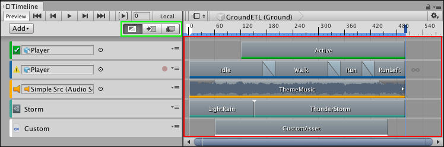
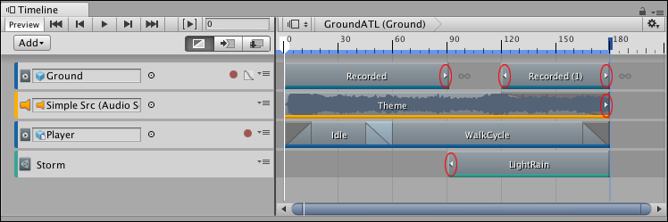
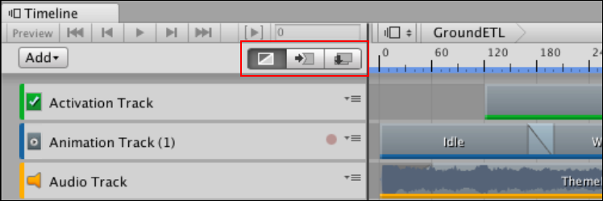
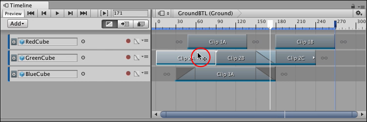
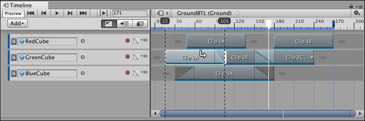
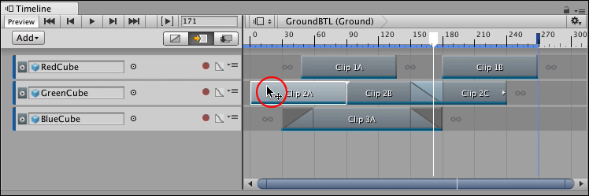
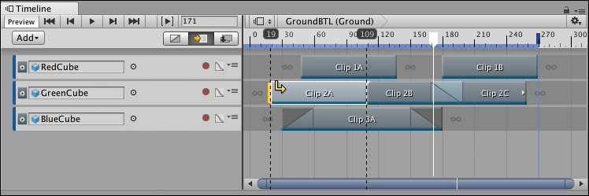
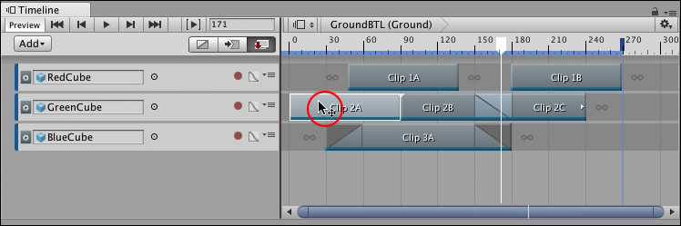
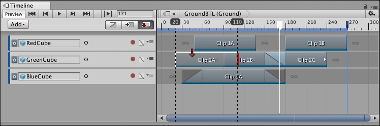

# Clip Edit modes and the Clips view

Use the Clips view to add, position, and manipulate clips on each track in the Track list. The selected Clip Edit mode determines how clips interact when you add, move, or delete them.

_The Clip Edit modes (green) and the Clips view (red)_

## Clips and the Clips view

In the Clips view, each clip has a colored accent line that identifies the type of clip: 

* Activation clips are green.
* Animation clips are blue.
* Audio clips are orange.
* Control clips are turquoise.
* Playable clips are white.

A clip based on data, such as an Animation clip or an Audio clip, displays arrows that indicate when the clip has been trimmed to exclude part of its source animation, waveform, or other data. For example, if an Animation clip uses only part of its full key animation, white arrows indicate that key animation exists before the start or after the end of the clip.

_Small arrows (circled) indicate that data exists before the start or after the end of the area defined by the clip_

To resize a clip and view its hidden data, either right-click the clip and select **Match Content** from the context menu, or select the clip and modify its clip timing properties in the Inspector window. When you resize a clip, the selected Clip Edit mode determines how the surrounding clips are affected.

## Clip Edit modes

Select a Clip Edit mode to choose how clips are added, positioned, and trimmed within the Clips view, or when modifying clip timing properties in the Inspector window. There are three Clip Edit modes that affect most clip editing features: Mix mode (default), Ripple mode, and Replace mode.

_Clip Edit modes are Mix (default and selected), Ripple, and Replace mode_

You can also temporarily switch between Clip Edit modes. This is useful if, for example, you want to temporarily use Ripple mode to offset the content of a track while you position clips. To temporarily switch between Clip Edit modes, hold down the following keyboard keys:

* Hold 1 to temporarily switch to Mix mode.
* Hold 2 to temporarily switch to Ripple mode. 
* Hold 3 to temporarily switch to Replace mode. 

### Mix mode

Use Mix mode to add, position, and trim clips without moving or replacing adjacent clips. Mix mode creates blends between intersecting clips. Mix mode is the default Clip Edit mode.

_Timeline window with Mix mode as the selected Clip Edit mode. The position cursor (circled) indicates where you drag to position the clip._

In Mix mode, when you hover over a selected clip in the Clips view, the cursor changes to indicate the action that you can perform. The action depends on the part of the clip that you hover over:

* When you hover over the start of a selected clip, the cursor changes to a trim cursor. The trim cursor indicates the area to drag to trim the start of the clip. 
* When you hover over the middle of a selected clip, the cursor changes to a position cursor and indicates the area to drag to position the clip. 
* When you hover over the end of a selected clip, the cursor changes to a trim cursor. The trim cursor indicates the area to drag to trim the end of the clip. 

In Mix mode, if you drag to trim or position a clip and it intersects another clip, the cursor changes to a white arrow that points towards the blend being created. There are three possible cursors depending on whether the blend is created at the beginning of the clip, at the end of the clip, or at both the beginning and end of the clip.

_The white arrow cursor indicates that dragging Clip 2A to the right creates a blend, at the end of the clip, between Clip 2A and Clip 2B._

### Ripple mode

Use Ripple mode to add, position, and trim a clip while affecting the subsequent clips on the same track. Positioning or trimming clips in Ripple mode preserves the gaps between subsequent clips.

_Timeline window with Ripple mode as the selected Clip Edit mode. The position cursor (circled) indicates where you drag to position the clip._

In Ripple mode, when you hover over a selected clip in the Clips view, the cursor changes to indicate the action that you can perform. The actions and areas are similar to Mix mode: 

* When you hover over the start of a selected clip, the cursor changes to a trim cursor. The trim cursor indicates the area to drag to trim the clip relative to its start.
* When you hover over the middle of a clip, the cursor changes to a position cursor and indicates the area to drag to position the clip.
* When you hover over the end of a clip, the cursor changes to a trim cursor. The trim cursor indicates the area to drag to trim the clip relative to its end.

In Ripple mode, when you click and drag to trim or position a clip, the cursor switches to a yellow arrow that points towards the affected clips and gaps. A yellow line indicates the ripple point. When you drag to trim a clip, dragging left and right changes the duration of the selected clip and repositions subsequent clips and gaps after the ripple point.

_For example, the yellow arrow cursor indicates that trimming the start of Clip 2A in Ripple mode changes the clip duration and affects the clips and gaps after the ripple point: Clip 2B and Clip 2C.]_

### Replace mode

Use Replace mode to add, position, and trim a clip while cutting or replacing intersecting clips.

_Timeline window with Replace mode as the selected Clip Edit mode. The position cursor (circled) indicates where you drag to position the clip._

In Replace mode, when you hover over a selected clip in the Clips view, the cursor changes to indicate the action that you can perform. The actions and areas are similar to Mix mode: 

* When you hover over the start of a selected clip, the cursor changes to a trim cursor. The trim cursor indicates the area to drag to trim the clip relative to its start.
* When you hover over the middle of a clip, the cursor changes to a position cursor and indicates the area to drag to position the clip.
* When you hover over the end of a clip, the cursor changes to a trim cursor. The trim cursor indicates the area to drag to trim the clip relative to its end.

In Replace mode, when you drag to position a clip, the clip becomes translucent so that you can view overlapping clips. If the clip being positioned overlaps other clips, the cursor changes to a red arrow and red replacement lines indicate where each overlap occurs. Releasing the clip cuts the underlying clip at each red overlap. 

_For example, the red arrow cursor indicates that dragging Clip 2A to the right overlaps Clip 2B. Releasing the clip cuts Clip 2B at the point where the overlap occurs._

In Replace mode, trimming a clip is similar to positioning a clip. When you drag to trim a clip and it intersects another clip, the cursor changes to a red arrow and a red replacement line indicates where the overlap occurs. Releasing the trim cuts the intersecting clip at the red replacement line.
