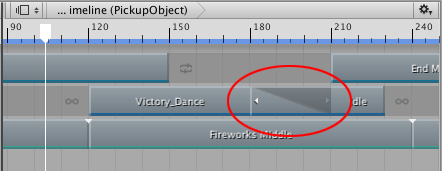
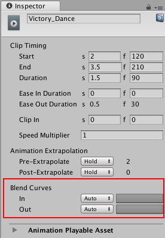
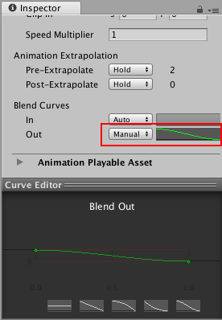

# Blending clips

Blend two clips on the same track to create a smooth transition between two Animation clips, two Audio clips, or two Playable clips. To blend two clips, select the Mix Clip Edit mode and position or trim one clip until it overlaps an adjacent clip. 

In a blend, the first clip is referred to as the **outgoing clip** and the second clip is referred to as the **incoming clip**. The area where the outgoing clip transitions to the incoming clip is referred to as the **blend area**. The blend area sets the duration of the transition.

_The blend area shows the transition between the outgoing clip and incoming clip_

Although the Clips view represents a blend area as a single linear curve, the transition between clips is actually comprised of two blend curves. The blend curve for the outgoing clip is referred to as the **Blend Out** curve. The blend curve for the incoming clip is referred to as the **Blend In** curve. By default, each blend curve is automatically set to an ease-in and ease-out curve. 

 

_Use Blend Curves to customize the blend area_

Use the **Blend Curves** in the Inspector window to change the shape for either the Blend In or Blend Out curve of the selected clip. However, the Inspector window only allows you to edit the properties of one clip at a time. You cannot simultaneously customize both blend curves from the same blend area.

To customize the **Blend Curves** for the transition between two clips:

1. Select the outgoing clip to customize its Blend Out curve (labelled **Out**).
2. Select the incoming clip to customize its Blend In curve (labelled **In**). 

To customize either the Blend Out curve or Blend In curve, use the drop-down menu to switch from **Auto** to **Manual**. With **Manual** selected, the Inspector window shows a preview of the blend curve. Click the curve preview to open the Curve Editor below the Inspector window.

_Select Manual and click the curve preview to open the Curve Editor_

Use the Curve Editor to customize the shape of the blend curve. By default, the blend curve includes a key at the beginning of the curve and a key at the end of the curve. The Curve Editor provides the following different methods of modifying the blend curve:

* Select the key at the start or end of the blend curve and use the tangent handles to adjust the interpolation between keys.
* Add additional keys to change the shape of the blend curve by adding more interpolation points. Adding keys in the Curve Editor is the same as [adding keys in the Curves view](crv_keys_add.md).
* Right-click a key to delete or edit the key. Editing keys in the Curve Editor is the same as [editing keys in the Curves view](crv_keys_edit.md). Note that you cannot delete the first and last keys.
* Select a shape template from the bottom of the Curve Editor.

The Curve Editor also includes shape templates based on whether you are modifying the Blend In curve or the Blend Out curve. Select a shape template to change the blend curve to the selected shape template.
