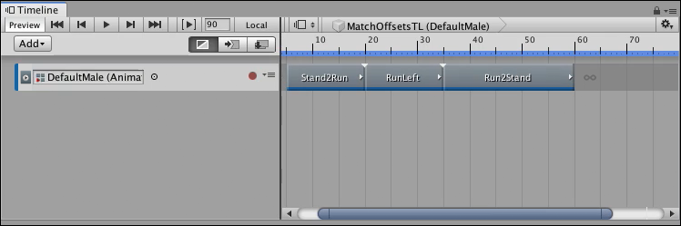
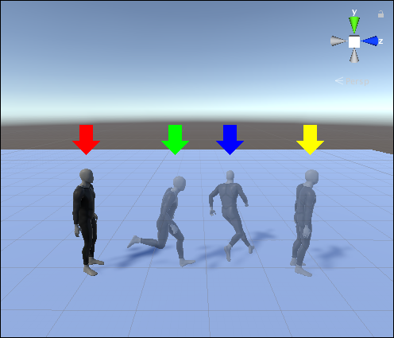
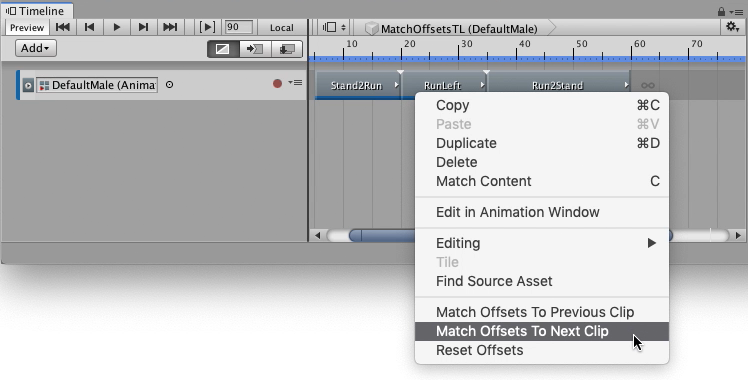
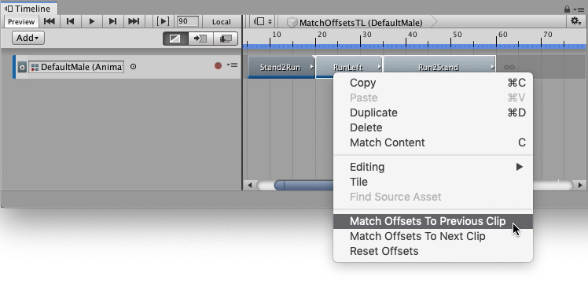

# Matching clip offsets

Every Animation clip contains key animation, or motion, that animates the GameObject, or humanoid, bound to the Animation track. 

When you add an Animation clip to an Animation track, its key animation or motion does not automatically begin where the previous clip ends. The key animation or motion also does not end where the next clip begins. By default, each Animation clip begins at the position and rotation of the GameObject, or humanoid, at the beginning of the Timeline instance.

_An animation sequence of three Animation clips._

For example, three Animation clips create an animation sequence that starts with a clip of a standing humanoid that starts to run, then turns left, and finally comes to a stand still.

Each Animation clip begins at the position and rotation of the humanoid at the start of the Timeline instance, indicated by a red arrow in the Scene view below. The three Animation clips, Stand2Run, RunLeft, and Run2Stand, end at the green, blue, and yellow arrows, respectively.

For an animation sequence to flow seamlessly between adjacent Animation clips, you must match each Animation clip with its previous clip or next clip. Matching clips adds a position and rotation offset for each Animation clip. The position and rotation offsets are named **Clip Transform Offsets** and they [can be set manually](insp_clp_anim_plyb.md) or automatically. The following sections describe how to automatically match two or many Animation clips.

## Matching two clips

To match the clip offsets between two clips, right-click the Animation clip that you want to match. From the context menu, select either **Match Offsets to Previous Clip** or **Match Offsets to Next Clip**.

_Matching an Animation clip with the next clip_

For example, right-click the middle Animation clip, named "RunLeft", and select **Match Offsets To Next Clip** to match its offsets to the next clip

When you are matching offsets for a single Animation clip, you don’t need to select the Animation clip first, but you must right-click the Animation clip that you want to match. For example, if you right-click an Animation clip that is not selected, Timeline matches the clicked clip and ignores the selected Animation clips.

The context menu only displays the match options available for the clicked Animation clip. For example, if there is a gap **before** the clicked Animation clip, only the **Match Offsets to Next Clip** menu item is available.

## Matching many clips

To match the clip offsets of many clips, select the adjacent Animation clips that you want to match and right-click one of the selected clips. From the context menu, select either **Match Offsets to Previous Clip** or **Match Offsets to Next Clip**.

_Matching many clips with previous clips_

For example, select the "RunLeft" and "Run2Stand" clips. Right-click one of the selected clips, and select **Match Offsets to Previous Clips**, to match the "RunLeft" clip with the previous "Stand2Run" clip, and to match "Run2Stand" with the previous "RunLeft" clip.

