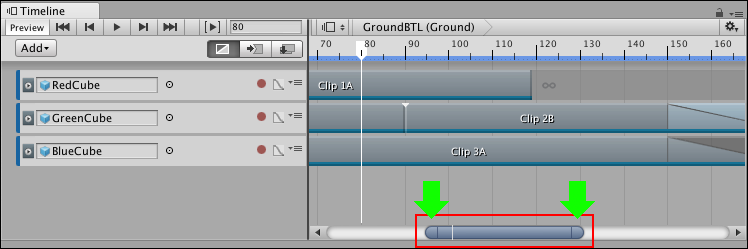

# Panning and zooming the Clips view

Use either the keyboard or the zoombar to pan and zoom the contents of the Clips view. There are many ways to pan, zoom, or frame clips in the Clips view with the keyboard:

* To pan, either middle-drag, or hold Alt and drag.
* To frame all selected clips, [select clips](clp_select.md) then press F.
* To frame all clips, press A.
* To zoom horizontally, move the scroll-wheel.
* To zoom vertically, hold Command/Control and move the scroll-wheel.

When you horizontally zoom the Clips view, the zoombar indicates the level of zoom. The zoombar is the horizontal bar at the bottom of the Clips view that zooms and pans the section of the Timeline instance or Timeline Asset that is shown in the Clips view.

_The zoombar (inside the red box) and the zoombar handles (shown by the green arrows). The zoombar thumb is the area between the two zoombar handles._

There are many ways to pan and zoom with the zoombar:

* To pan, drag the zoombar thumb left or right.
* To jump to a section of the Timeline instance or Timeline Asset, click on an empty area of the scrollbar, on either side of the zoombar.
* To zoom in or zoom out, drag either zoombar handle. Dragging a zoombar handle also resizes the zoombar thumb. 

On the zoombar thumb, a white line indicates the location of the Timeline Playhead. Use this line to see where the Timeline Playhead is in relation to the zoom level and the part of the Timeline instance shown in the Clips view.

