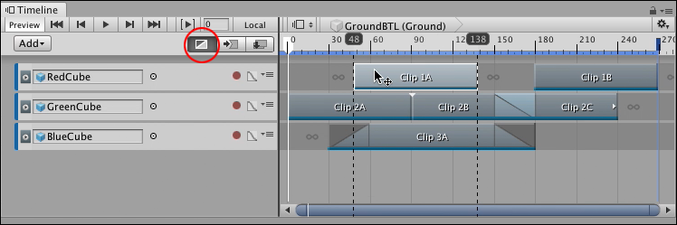
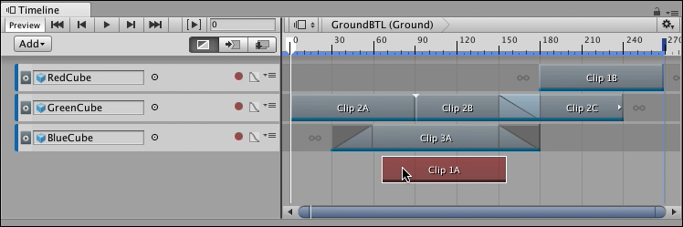
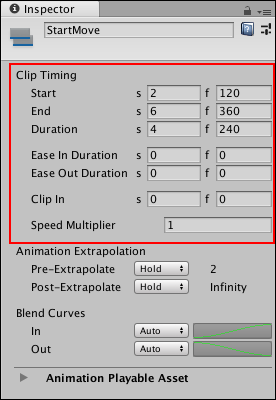
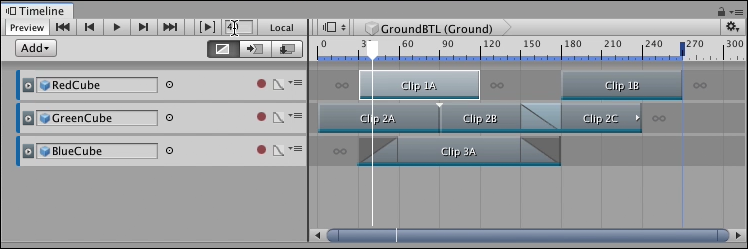
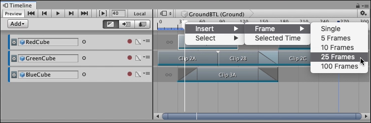

# Positioning clips

To position a clip, select Mix mode as the Clip Edit mode. Select a clip and hover over the middle of the clip. When the cursor changes to a position cursor, click and drag the clip to its new position.

While dragging, black lines indicate the selection of clips being positioned. The Timeline ruler shows the start time and end time of the selected clips being positioned.

_Select Mix mode (circled). Select and drag to position a clip._

By default, when you drag to position clips, both Snap to Frame and Edge Snap are enabled in the Clips view. You can change these snap settings in the [Timeline Settings](tl_settings.md) menu.

You can also move a clip to another track of the same type. Drag the clip off of its current track and a white ghost indicates where the clip will be moved. If you drag a clip to an area where the clip cannot be placed, the ghost changes to red indicating that you cannot release the clip in that area. For example, you cannot drag a clip where there is no track. 

_The ghost of the selection being moved is drawn in red if you attempt to move a clip to an invalid area_

You can position a selection of clips on the same track, or on different tracks. You are not limited to positioning one clip at a time. The same edge snapping rules and invalid area restrictions apply when positioning a selection of clips on many tracks.

## Positioning clips with the Inspector window

You can use the [Inspector window to position clips](insp_clp.md). To position a clip with the Inspector window, select a clip and use the Clip Timing properties in the Inspector window to change its **Start** property.

_Clip Timing properties for an Animation clip_

The effect that changing the Start value has on adjacent clips depends on the selected Clip Edit mode.

## Positioning clips in different Clip Edit modes

You are not restricted to positioning clips with Mix mode as the selected Clip Edit mode. You can also position clips in Ripple mode and in Replace mode. The difference is the effect each Clip Edit mode has on adjacent clips on the tracks where clips are being moved:

* Positioning clips in Mix mode creates blends between intersecting clips.
* Positioning clips in Ripple mode ripples subsequent clips, respecting the gaps between clips.
* Positioning clips in Replace mode cuts or replaces intersecting clips.

## Positioning clips with the Timeline Playhead

You can position clips by inserting frames at the position of the Timeline Playhead. To do this, move the Timeline Playhead to where you want to insert frames.

_To insert frames starting at frame 40, move the Timeline Playhead to frame 40_

Right-click the Timeline Playhead on the Timeline ruler above the Clips view, choose **Insert** &gt; **Frame**, and a number of frames. 

_To insert 25 frames, right-click the Timeline Playhead and select **Insert** &gt; **Frame**, then 25 Frames_

This inserts frames in the Timeline Asset at the position of the Timeline Playhead. Inserting frames only repositions the clips that start **after** the position of the Timeline Playhead.

_Only the clips that start after the Timeline Playhead are moved. In this example, inserting 25 frames at frame 40 affects Clip 1B, Clip 2B, and Clip 2C._

