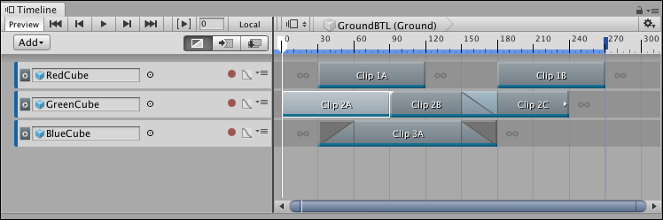
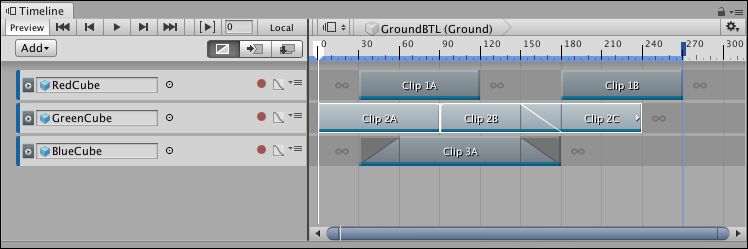
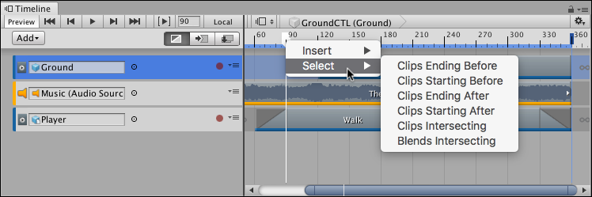

# Selecting clips

Click to select a single clip. The Clips view displays the selected clip with a white border, including its blends. Selecting a clip deselects all other tracks or clips.

Selecting a clip also shows its properties in the Inspector window. The clip properties change depending on the type of clip and whether multiple clips are selected. See [Setting Clip properties](insp_clp.md) for details.

Hold Shift and click to select contiguous clips vertically on different tracks or horizontally on the same track. For example, to select three contiguous clips on the same track, select the first clip, then hold Shift and click the third clip. All three clips are selected.

_Click to select the first clip_

_Shift-click the third clip to select contiguous clips on the same track_

Hold Command/Control and click to select discontiguous clips. Hold Command/Control and click a selected clip to deselect it.

Click and drag on an empty area in the Clips view to draw a selection rectangle. This selects all clips inside the rectangle, including the clips that intersect the rectangle. Hold down Shift and draw a selection rectangle to add clips to the current selection.

You can also press the Tab key to select clips. The behaviour of the Tab key changes depending on the current selection:

* If a track is selected, press Tab to select the first clip on the selected track.
* If many tracks are selected, press Tab to select the first clip on the first selected track.
* If a clip is selected, press Tab to [select its track](trk_select.md).
* If there are no clips or tracks selected, press Tab to select the first clip on the first track.

Use the arrow keys to change the selected clips. The behaviour and results depend on the current selection and which modifier keys you press:

* If nothing is selected in the Timeline window, press the Tab, Up arrow, or Down arrow key to select the first clip on the first track.
* If a clip is selected, press the Left arrow key to select the previous clip. If the selected clip is the first clip on a track, the Left arrow key selects the track.
* If a clip is selected, press the Right arrow key to select the next clip. Press the Up arrow key to select the closest clip on a previous track. Press the Down arrow key to select the closest clip on a next track.
* Hold Shift and press either the Left arrow key or Right arrow key to add or remove clips from the selection of clips. Whether a clip is added to or removed from the selection of clips is relative to the first selected clip.

If you zoom into the Clips view, it pans to show either the start or end of the most recently selected clip. For example, if a selected clip is framed in the Clips view and you press the Right arrow key to select the next clip which is outside the Clips view, the Clips view pans to show the start of the selected clip.

You can also select clips with the Timeline Playhead. Right-click the Timeline Playhead and choose a selection option. This selects clips that either start after, start before, end after, end before, or intersect the Timeline Playhead. Clips are selected on all tracks.

_Right-click the Timeline Playhead and choose **Select** for more clip selection options_

