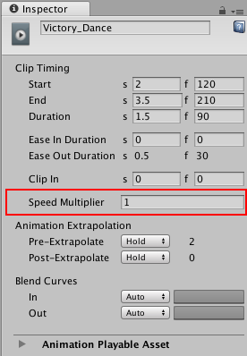
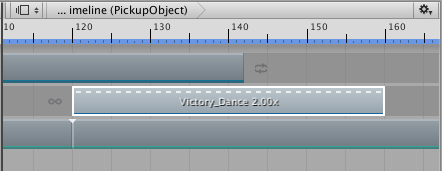

# Changing clip play speed

Change the clip play speed to accelerate or decelerate its audio, motion, animation, or particle effect. Changing the clip play speed affects the duration of the clip. You can only change the play speed for Animation clips, Audio clips, and Control clips.

To change the clip play speed, first, select the Clip Edit mode to determine how other clips on the same track are affected: 

* If the change in duration results in two clips that overlap each other: 
    * Select Mix mode to create a blend.
    * Select Replace mode to cut or remove intersecting clips.
* Select Ripple mode to reposition the clips that come after the clip being sped up or slowed down. Ripple mode preserves the gaps between clips. 

Select the clip and set the **Speed Multiplier** property in the Inspector window. The **Speed Multiplier** property shows the play speed as a multiplier of the original clip speed, so 1 plays the clip at the same speed as the original clip.

_Speed Multiplier in the Inspector window_

For example, to double the play speed of an Animation clip, change the **Speed Multiplier** to 2. This changes the duration of an 80 frame Animation clip to 40 frames by doubling its play speed.

There are other ways to change the play speed of a clip:

* Right-click the clip and select **Editing &gt; Double Speed** to halve the clip duration. The clip plays at twice its current speed. A short-dashed line and a multiplication factor indicates an accelerated clip. Doubling the clip speed sets the **Speed Multiplier** property to double its current value. 
* Right-click the clip and select **Editing &gt; Half Speed** to double the clip duration. The clip plays at half its current speed. A long-dashed line and multiplication factor indicates a decelerated clip. Halving the clip speed sets the **Speed Multiplier** property to half its current value. 
* Right-click the clip and select **Editing &gt; Reset Speed** to reset the clip to its original speed. This is the original duration of the clip. Resetting the clip speed sets the **Speed Multiplier** property to 1.

_A short-dashed line and multiplication factor of 2.00x indicates a clip playing at double its original speed_

