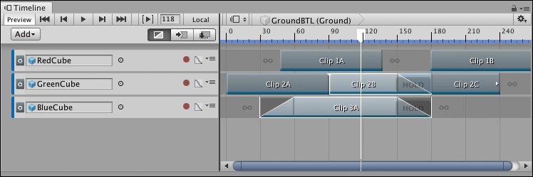
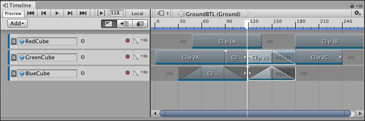

# Splitting clips

You can split a clip into two identical clips that have different start points, end points, and durations. You can extend the start or end of the clip to include split animation or audio. You can also [reset a clip](clp_reset.md) to undo a split and other edits.

To split a clip, select the clip, position the playhead where you want to split the clip, and either right-click the clip and select **Editing** &gt; **Split**, or press S. Any selected clips that intersect the playhead are split into separate clips. You can position, trim, and edit split clips independently.

_Select the clips to be split, position the playhead where you want the split to occur, and press S_

_Selected clips are split where each clip intersects the playhead_

If a split clip is part of a blend, or if the split is performed within a blend, Timeline copies the blend settings to the split clips.
