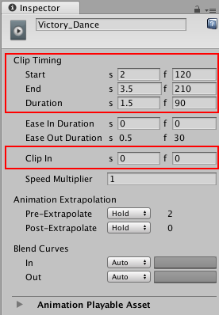
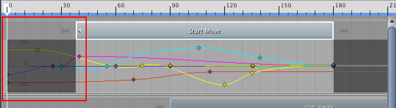
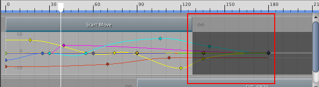
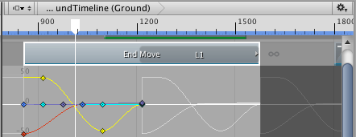
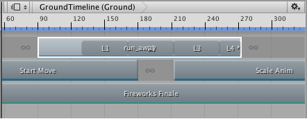
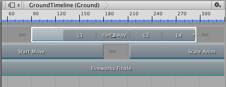
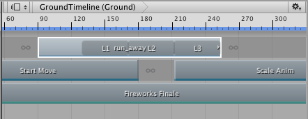
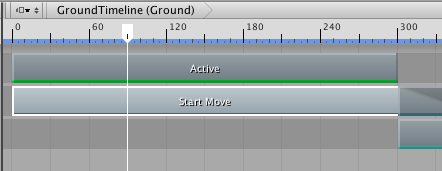
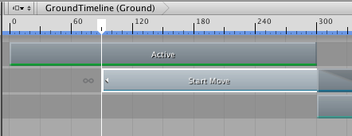

# Trimming clips

Trimming a clip cuts off a portion of the clip at its start or end. To trim a clip, select the Mix mode as the Clip Edit mode, then drag the start or end of the clip. Dragging the start or end of a clip automatically selects the clip, showing its properties in the Inspector window. Use the [Clip Timing properties](insp_clp.md) in the Inspector window to set the start, end, duration, and offset (Clip In) of a clip to exact values.

_Position and trim a clip by adjusting its Start, End, Duration, and Clip In properties in the Inspector window_

## Trimming the start of a clip

Trimming an Animation clip or Audio clip after the start of the Source Asset, selects the part of the Source Asset the clip uses.

_Trimming the start of an Animation clip trims its key animation, relative to the start of the Source Asset_

Trimming a clip is non-destructive. Trim the clip again to modify its start to include the animation, or the audio waveform, cut off during a previous trim. You can also [reset a clip](clp_reset.md) to undo trims or other edits.

To trim the start of a clip to a precise time or frame, use the **Clip In** property in the Inspector window. 

Changing the **Clip In** property is similar to the same effect as trimming the start of a clip after the start of its Source Asset.

## Trimming the end of a clip

As with the start of the clip, trimming an Animation clip or Audio clip before the end of the Source Asset, selects the part of the Source Asset the clip uses.

_Trimming the end of an Animation clip trims its key animation, relative to the end of the Source Asset_

If you trim the end of an Animation clip or Audio clip past the end of the Source Asset the clip is based on, the extra clip area either holds or loops, depending on the settings of the Source Asset.

For example, an Animation clip named "End Move" uses the motion file "Recorded(2)" as its Source Asset. The motion file "Recorded(2)" is set to loop. Trimming the end of the Animation clip past the end of the "Recorded(2)" Source Asset fills the extra clip area by looping "Recorded(2)". A white animation curve shows the hold or loop.

_A white animation curve indicates whether the extra clip area holds or loops data, depending on the Source Asset_

To choose whether the extra clip area holds or loops, select the Source Asset to change its settings in the Inspector window. Depending on the type of Source Asset, different properties control whether the Source Asset holds or loops.

If you are unsure which Source Asset is used by a clip, select the clip in the Clips view, right-click and select **Find Source Asset** from the context menu. This highlights the Source Asset in the Project window. 

## Trimming the end of looping clips

The Timeline window provides special trimming options for Animation clips or Audio clips with loops. These special trim options either remove the last partial loop or complete the last partial loop.

For example, the Animation clip named run_away is over three times longer than the Source Asset on which it is based. Since the Source Asset is set to loop, the Animation clip loops the Source Asset until the Animation clip ends which results in a partial loop.

 

_L1, L2, and L3 signify complete loops. The clip ends partially through the fourth loop, L4._

To extend the end of the clip and complete a partial loop, select the clip, right-click and select **Editing** &gt; **Complete Last Loop**. To trim the clip at the last complete loop, select the clip, Right-clip and select **Editing** &gt; **Trim Last Loop**.

_The result of select **Editing** &gt; **Complete Last Loop**_

_The result of select **Editing** &gt; **Trim Last Loop**_

## Trimming with the Timeline Playhead

You can also trim a clip based on the location of the playhead. To trim using the playhead, position the playhead within the clip to be trimmed. Right-click the clip and select either **Editing** &gt; **Trim Start** or **Editing** &gt; **Trim End**. **Trim Start** trims the start of the clip to the playhead. **Trim End** trims the end of the clip to the playhead.

_Move the Timeline Playhead within the _

_Right-click and select **Editing** &gt; **Trim Start** to trim the start of the clip to the playhead_

If you select clips on multiple tracks, Timeline only trims the selected clips that intersect the playhead.
