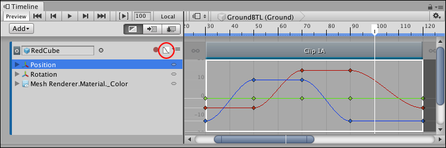
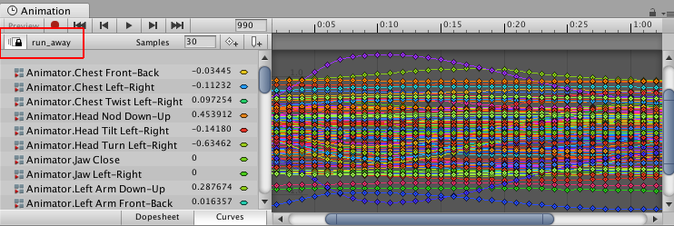

# Curves view

The Curves view shows the animation curves for Infinite clips, or for Animation clips that were converted from Infinite clips. Use the Curves view for basic animation editing such as adding keys, modifying keys, adjusting tangents, and changing the interpolation between keys.

To view animation curves for an Infinite clip, click the Curves icon next to the Track name. To view animation curves for an Animation clip, select the Animation clip and click the Curves icon. The Curves view is similar to [Curves mode](https://docs.unity3d.com/Manual/animeditor-AnimationCurves.html) in the Animation window.

_The Curves icon (circled) shows and hides the Curves view for the selected clip_

The Curves icon does not appear for Animation tracks with humanoid animation or imported animation. To view and edit key animation for humanoid or imported Animation clips, right-click an Animation clip and select **Edit in Animation Window** from the context menu. You can also double-click the Animation clip. The Animation window appears, linked to the Timeline window.

When in linked mode, the Animation window shows a Linked icon and the name of the Animation clip being edited. Click the Linked icon to stop editing the Animation clip and to release the Animation window from linked mode.

_Animation window linked to the Timeline window, indicated by the Linked icon and Animation clip name_

