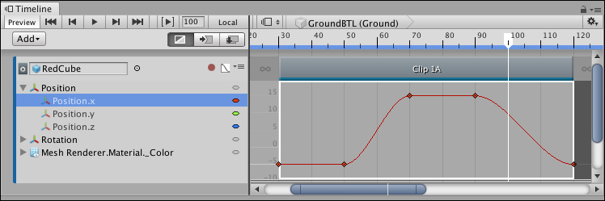

# Hiding and showing curves

For the selected Animation clip, the Curves view includes a hierarchical list of the properties with animation curves. Expand, collapse, select, and deselect the properties in this list to filter which animation curves show in the Curves view. 

For example, to show only the X-axis animation curves for the position of a GameObject, expand **Position**, select the **Position.x** property, and then press F to frame the animation curve for the **Position.x** property.

 

_Curves view showing the animation curve for the Position.x property_

There are many ways to expand, collapse, select, and deselect animation curves:

* Click the Triangle icon of a parent property to expand and collapse its list of child properties.
* Hold Shift and click to select contiguous properties.
* Hold Command/Control and click to select discontiguous properties. Hold Command/Control and click a selected property to deselect it.
