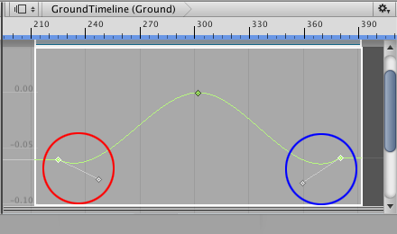
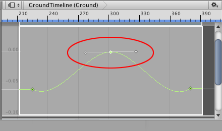
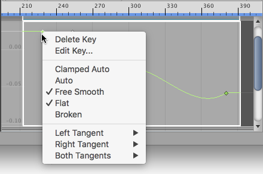

# Changing interpolation and shape

Every key has one or two tangents that control the interpolation of the animation curve. The term **interpolation** refers to the estimation of values that determine the shape of the animation curve between two keys.

Whether a key has one of two tangents depends on the location of the key on the animation curve. The first key only has a right tangent that controls the interpolation of the animation curve after the key. The last key only has a left tangent that controls the interpolation of the animation curve before the last key. 

_The first key (red) only has a right tangent, and the last key (blue) only has a left tangent_

All other keys have two tangents where the left tangent controls the interpolation before the key, and the right tangent controls the interpolation after the key. By default, tangents are joined. Dragging one tangent affects the position of both tangents, and the interpolation of the animation curve both before and after the key. 

_Keys that are neither the first key nor last key have joined tangents by default. Dragging either tangent changes the interpolation of the animation curve both before and after the key._

Dragging a tangent may also change the interpolation mode of the animation curve. For example, most keys are set to the **Clamped Auto** interpolation mode which automatically smooths animation curve as it passes through the key. If you drag a tangent of a key set to **Clamped Auto**, the interpolation mode changes to **Free Smooth**.

The term **interpolation mode** refers to the interpolation algorithm that determines which shape to use when drawing the animation curve. 

To view the interpolation mode for a key, select the key and right-click. The context menu shows the interpolation mode. To change the interpolation mode for a key, select the key, right-click and select another interpolation mode.

_The context menu shows the interpolation mode for the selected key. Use the context menu to change the interpolation mode._

Some interpolation modes break the left and right tangents so that you can position them separately. When tangents are broken, you can set a separate interpolation mode for the animation curve before the key and the animation curve after the key. For more details on the different interpolation modes, see [Editing Curves](EditingCurves). In the [Animation window documentation](AnimationEditorGuide), the interpolation mode is referred to as **tangent type**.
