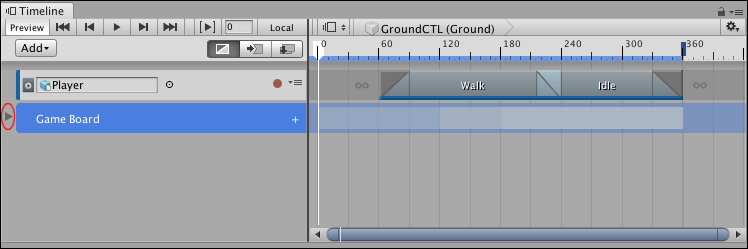

# Collapsing and expanding Track groups

To collapse the tracks in a Track group, click the Triangle icon beside the name of the Track group. The tracks are collapsed from view in the Timeline window, not muted. To expand the tracks in a Track group, click the Triangle icon again.

_Triangle icon (circled) collapses the tracks in the Game Board Track group. A ghost track visually represents the tracks in the collapsed group._

You can also press the Left Arrow key to collapse the tracks in a Track group while the Track group is selected. Press the Right Arrow key to expand the tracks in a Track group. If you press the Right Arrow key with a Track group already selected, the selection switches to the first selectable clip on the first track in the Track group.
