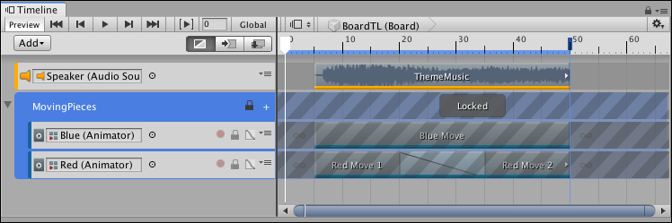

# Locking Track groups 

You can also lock a Track group to prevent editing its Track sub-groups, tracks, and clips. This is useful when you have finished animating the content within a Track group and you want to avoid inadvertently modifying its tracks or clips. 

You cannot edit the tracks or select the clips in a locked Track group. The Lock icon identifies a locked Track group.

_Selected and locked Track group with Lock icon (red circle)_

To lock a Track group, right-click on the Track group header and select **Lock** from the context menu. You can also select a Track group and press L. You can select and lock multiple Track groups.

To unlock a Track group, click the Lock icon. You can also select a locked Track group and press L, or right-click and select **Unlock** from the context menu. Tracks in a Track group maintain their individual locked state when you lock a Track group. This means that if you lock a track  and then lock its Track group, when you unlock the Track group, the track remains locked. 

For example, the MovingPieces Track group has its first track locked and its second track unlocked. If you lock the Track group, both the first and second track are locked. If you unlock the Track group, the first track remains locked and the second track is unlocked because the first track was already locked before the Track group was locked.
