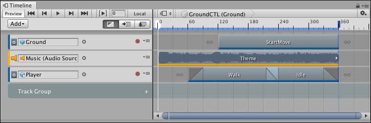
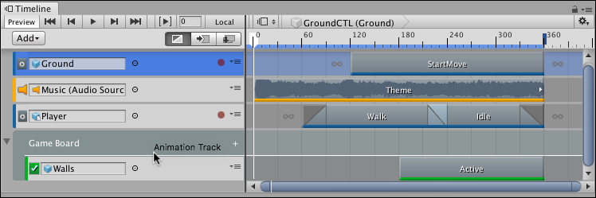
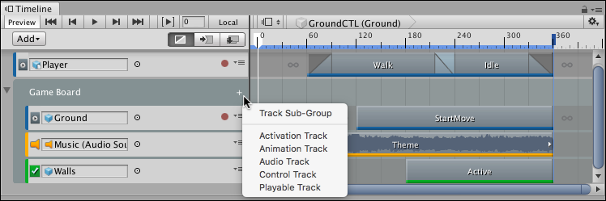

# Using Track groups

Use Track groups to organize tracks when you are working with many tracks. For example, a Timeline Asset contains an Animation track and an Audio track that interacts with the same GameObject. To organize these tracks, move them into their own Track group. 

To add a Track group, click the **Add** button and select **Track Group** from the **Add** menu. You can also right-click an empty area of the Track list and select **Track Group** from the context menu. A new Track group appears at the bottom of the Track list.

_Timeline window with Track group added_

To rename a Track group, click its name and an I-beam cursor appears. Type the new name for the Track group and press Return. 

To move tracks into a Track group, select one or more tracks and drag over the Track group. The Track group is highlighted. When dragging a selection of tracks, the last selected track type displays beside the cursor. To drop the tracks before a specific track in the Track group, drag until a white insert line indicates the destination.

_Release the mouse button when the white insert line appears within the Track group_

_Selected tracks are moved to the location of the insert line_

A Track group can also have any number of Track sub-groups. To add a Track sub-group, either select a Track group and click the **Add** button in the Track list, or click the Plus icon beside the Track group name, and select **Track Sub-Group**. You can also use this menu to add tracks directly to a Track group or a Track sub-group.

_Click the Plus icon to add Track Sub-Groups and tracks to Track groups_

