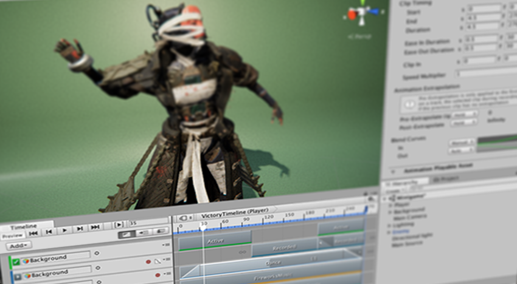

# About Timeline

_Unity's Timeline_

Use Unity's Timeline to create cinematic content, game-play sequences, audio sequences, and complex particle effects.

Each cut-scene, cinematic, or game-play sequence that you create with Unity's Timeline consists of a Timeline Asset and a Timeline instance. The [Timeline window](tl_window.md) creates and modifies Timeline Assets and Timeline instances simultaneously. 

The [Timeline Overview section](tl_about.md) includes details on the relationship between the Timeline window, Timeline Assets, and Timeline instances.

The [Using Timeline section](wf_about.md) shows how to create Timeline Assets and Timeline instances, record basic animation, animate humanoids, and use other Timeline features.

# Installing Timeline

Timeline is a Package and is installed through the Packages window in Unity. Consult the [Packages window documentation](https://docs.unity3d.com/Manual/upm-ui.html) for more information.

# Technical details
## Requirements

This version of Timeline is compatible with the following versions of the Unity Editor:

* 2019.1 and later (recommended)

## Package contents

The following table indicates the folder structure of the Timeline package:

|Location|Description|
|---|---|
|`<Runtime>`|Root folder containing the source for the Timeline Runtime. This is the source for what is available in the Player. |
|`<Editor>`|Root folder containing the source for the Timeline Editor used to edit Timeline files inside the Unity Editor.|

## Document revision history

|Date|Reason|
|---|---|
|October 10, 2018|Document created. Matches package version 0.0.0|
