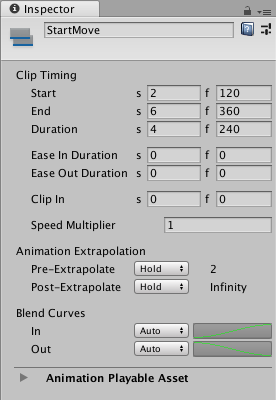
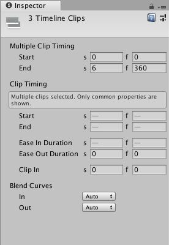

# Timeline properties in the Inspector window

The Inspector window displays information about the selected GameObject including all attached components and their properties. This section documents the properties in the Inspector window that appear when you select one or many Timeline Assets, tracks, clips, or a combination.

If you select a single Timeline Asset, track, or clip, the Inspector window displays the properties for the selected Asset, track, or clip. For example, if you select an Animation clip, the Inspector window shows the [common properties](insp_clp_anim_com.md) and [Playable Asset properties](insp_clp_anim_plyb.md) for the selected Animation clip.

_Inspector window when selecting an Animation clip in the Timeline window_

If you select multiple Timeline Assets, tracks, or clips, the Inspector window shows two sections: a section with properties that apply to the entire selection, and a section of common properties that apply to each selected object individually.

For example, if you select an Audio clip on one track and two Animation clips on another track, the Inspector window includes **Multiple Clip Timing** properties and **Clip Timing** properties:

* Use the **Multiple Clip Timing** properties to change the **Start** or **End** of the selection as a group. For example, if you change the **Start** to frame 30, the selection of clips start at frame 30. This moves the start of the first clip to frame 30 and the remaining selected clips are placed relative to the first clip, respecting gaps between selected clips.
* Use the **Clip Timing** properties to change the common properties for each selected clip. If the selected clips have different values for the same property, the value is represented with a dash ("-"). If you change the dash to a value, it sets the value for all selected clips. For example, if you change the **Ease In Duration** from a dash to 10 frames, the ease in of each selected clip changes to 10 frames. 

_Inspector window when selecting multiple clips, on multiple tracks, in the Timeline window_

If your selection does not have common properties, the Inspector window prompts you to narrow the selection. For example, if you select an Animation track and an Audio clip in the Timeline window, you are prompted to narrow the selection:

_The message in the Inspector window when the selection does not have common properties_

