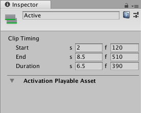

# Activation clip properties

Use the Inspector window to change the name of an Activation clip and its **Clip Timing**. 

_Inspector window when selecting an Activation clip in the Timeline window_

## Display Name

The name of the Activation clip shown in the Timeline window. By default, each Activation clip is named "Active". 

## Clip Timing properties

Use the **Clip Timing** properties to change the position and duration of the Activation clip. 

Most timing properties are expressed in both seconds (s) and frames (f). When specifying seconds to modify a **Clip Timing** property, all decimal values are accepted. When specifying frames, only integer values are accepted. For example, if you attempt to enter 12.5 in a frames (f) field, it is set to 12 frames.

Depending on [the selected Clip Edit mode](clp_about.md), changing the **Start**, **End**, or **Duration** may ripple or replace Activation clips on the same track.

|**Property** |**Description** |
|:---|:---|
|**Start**|The frame or time (in seconds) when the clip starts. Changing the Start also affects the End. Changing the Start sets the End to the new Start value plus the Duration.|
|**End**|The frame or time (in seconds) when the clip ends. Changing the End also affects the Start. Changing the End sets the Start to the new End value minus the Duration.|
|**Duration**|The duration of the clip in frames or seconds. Changing the Duration also affects the End. Changing the Duration sets the End to the Start value plus the new Duration.|
