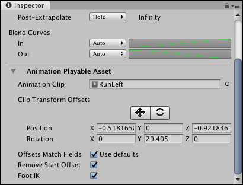

# Animation clip Playable Asset properties

Use the Inspector window to change the Playable Asset properties of an Animation clip. These properties include controls for manually applying position and rotation clip offsets, and options for overriding default clip matching. 

To view the Playable Asset properties for an Animation clip, select an Animation clip in the Timeline window and expand **Animation Playable Asset** in the Inspector window.

_Inspector window showing the **Animation Playable Asset** properties for the selected Animation clip_

## Animation Clip

Use the **Animation Clip** to change the source asset used by the clip on the Animation track. The source asset is either a [recorded Infinite clip](wf_rec_anim.md) or an [external motion clip](wf_char_anim.md).

## Clip Transform Offsets

Use the **Clip Transform Offsets** area to manually apply position and rotation offsets to the selected Animation clip. The tools and properties underneath the Clip Transform Offsets provide two methods of manually applying offsets based on the selected source: 

|**Property:** |**Description:** |
|:---|:---|
|**Move tool**|Shows a Move Gizmo in the Scene view. Use the Move Gizmo to manually position the clip offset for the selected Animation clip. Using the Move Gizmo changes the Position coordinates.|
|**Rotate tool**|Shows a Rotate Gizmo in the Scene view. Use the Rotate Gizmo to manually rotate the clip offset for the selected Animation clip. Using the Rotate Gizmo changes the Rotation coordinates.|
|**Position**|Manually sets the clip offset in X, Y, and Z coordinates. By default, the Position coordinates are set to zero and are relative to the [track offsets](insp_trk_anim.md).|
|**Rotation**|Manually sets the clip rotation offset around the X, Y, and Z axes. By default, the Rotation axes are set to zero and are relative to the [track offsets](insp_trk_anim.md).|

You can also [automatically match the clip offsets](clp_match.md) based on the end of the previous Animation clip, or the start of the next Animation clip. The transforms that are matched depends on the **Offset Match Fields**.

## Offsets Match Fields

Use **Offsets Match Fields** to choose which transforms to match when [matching clip offsets](clp_match.md). By default, **Use Defaults** is enabled and uses the default matching options set for the [Animation track](insp_trk_anim.md).

Disable **Use Defaults** to override the track matching options and choose which transformations to match when performing a Match Offsets to Previous Clip or Match Offsets to Next Clip for the selected Animation clip. When you disable **Offsets Match Fields**, a series of additional checkboxes appear. Use these additional checkboxes to enable or disable matching per coordinate, for both position and rotation.

## Remove Start Offset

Enable **Remove Start Offset** to make the Animation clip begin at position zero and rotation zero. The rest of the position and rotation keys in the Animation clip follow from zero. Enabling **Remove Start Offset** makes it easier to match the Animation clip with the previous Animation clip.

Disable **Remove Start Offset** to keep the starting position and rotation. The Animation clip starts from its original position and rotation. 

## Foot IK 

Enable **Foot IK** if the Animation clip is animating a humanoid and you want to use inverse kinematics for foot solving. Inverse kinematics attempts to remedy foot sliding by solving and influencing foot placement from the foot to the hip of the humanoid. 

Disable Foot IK if the Animation clip is animating a non-humanoid object such as a moving platform or a quadruped character with a non-human bone structure.
