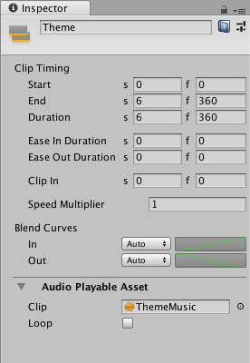

# Audio clip properties

Use the Inspector window to change the properties of an Audio clip. These properties include the name, timing, play speed, blend properties, audio media, and loop option.

_Inspector window when selecting an Audio clip in the Timeline window_

## Display Name

The name of the Audio clip shown in the Timeline window. This is not the name of the audio file that Unity uses for the waveform. For information on audio file properties, see **Audio Playable Asset** below.

## Clip Timing properties

Use the **Clip Timing** properties to position, change the duration, change the ease-in and ease-out duration, and adjust the play speed of the Audio clip. 

Most timing properties are expressed in both seconds (s) and frames (f). When specifying seconds, a **Clip Timing** property accepts decimal values. When specifying frames, a property only accepts integer values. For example, if you attempt to enter 12.5 in a frames (f) field, the Inspector window sets the value to 12 frames.

Depending on [the selected Clip Edit mode](clp_about.md), changing the **Start**, **End**, or **Duration** may blend, ripple, or replace Audio clips on the same track.

|**Property** |**Description** |
|:---|:---|
|**Start**|The frame or time (in seconds) when the clip starts. Changing the Start property changes the position of the clip on its track in the Timeline Asset. Changing the Start also affects the End. Changing the Start sets the End to the new Start value plus the Duration.|
|**End**|The frame or time (in seconds) when the clip ends. Changing the End also affects the Start. Changing the End sets the Start to the new End value minus the Duration.|
|**Duration**|The duration of the clip in frames or seconds. Changing the Duration also affects the End. Changing the Duration sets the End to the Start value plus the new Duration.|

## Blend Curves

Use the **Blend Curves** to customize the fade-in and fade-out between the outgoing and incoming Audio clips. See [Blending clips](clp_blend.md) for details on how to blend clips and customize blend curves.

When easing-in or easing-out Audio clips, use the **Blend Curves** to customize the curve that fades-in or fades-out an Audio clip. See [Easing-in and Easing-out clips](clp_ease.md) for details.

## Audio Playable Asset

Use the **Audio Playable Asset** properties to select the Audio file used by the Audio clip and to set whether the selected Audio clip loops (**Loop** enabled) or plays once (**Loop** disabled). 
