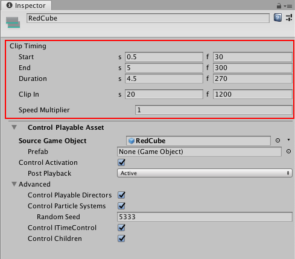

# Control clip common properties

Use the Inspector window to change the common properties of a Control clip. You can only create a Control clip in a Control track. A Control clip is a special clip that controls a nested Timeline instance, Particle System, Prefab instance, or ITimeControl Script, depending on how you create the Control clip:

* If you create the Control clip from a GameObject with a Playable Director component associated with a Timeline Asset, then the Control clip controls a nested Timeline instance. If the GameObject parents other GameObjects associated with many Timeline Assets, then the Control clip controls multiple Timeline instances.
* If you create the Control clip from a GameObject with a Particle System component, then the Control clip controls a Particle System.
* If you create the Control clip from a GameObject linked to a Prefab, then the Control clip controls a Prefab instance.
* If you create the Control clip from a GameObject with a script that implements the ITimeControl interface, then the Control clip controls an ITimeControl Script.

The common properties of a Control clip include its name and Clip Timing properties. Not all common properties apply to all types of Control clips.

_Inspector window when selecting a Control clip in the Timeline window_

## Display Name

The name of the Control clip shown in the Timeline window.

## Clip Timing properties

Use the **Clip Timing** properties to position and change the duration of the Control clip.

Most timing properties are expressed in both seconds (s) and frames (f). When specifying seconds, a **Clip Timing** property accepts decimal values. When specifying frames, a property only accepts integer values. For example, if you attempt to enter 12.5 in a frames (f) field, the Inspector window sets the value to 12 frames.

Depending on the [selected Clip Edit mode](clp_about.md), changing the **Start**, **End** or **Duration** of a Control clip may create an insert or replace clips on the same track. You cannot create a blend between Control clips.

|**Property:** |**Description:** |
|:---|:---|
|**Start**|The frame or time (in seconds) when the Control clip starts. Changing the Start changes the position of the Control clip on its track in the Timeline Asset. Changing the Start also affects the End. Changing the Start sets the End to the new Start value plus the Duration.|
|**End**|The frame or time (in seconds) when the Control clip ends. Changing the End also affects the Start. Changing the End sets the Start to the new End value minus the Duration.|
|**Duration**|The duration of the clip in frames or seconds. Changing the Duration also affects the End. Changing the Duration sets the End to the Start value plus the new Duration.|
|**Clip In**|Sets the offset of when the Control clip starts playing. The Clip In property only affects Particle Systems and nested Timeline instances.|
|**Speed Multiplier**|A speed multiplier that affects the playback speed of the Control clip. This value must be greater than 0. The Speed Multiplier property only affects Particle Systems and nested Timeline instances.|
