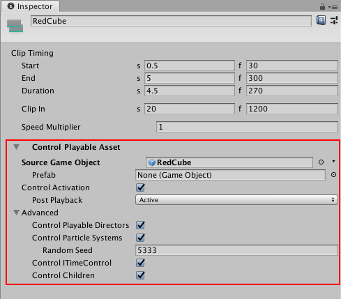

# Control clip Playable Asset properties

Use the Inspector window to change the playable asset properties of a Control clip. To view the playable asset properties for a Control clip, select a Control clip in the Timeline window and expand **Control Playable Asset** in the Inspector window.

_Inspector window showing the **Control Playable Asset** properties for the selected Control clip_

## Source Game Object

Use **Source Game Object** to select the GameObject with the Particle System, nested Timeline instance, or ITimeControl Script for the selected Control clip. Changing the **Source Game Object** changes what the Control clip controls.

## Prefab

Use **Prefab** to select a Prefab to instantiate when the Timeline instance plays in Play Mode. When a Prefab is selected, the label of the **Source Game Object** property changes to **Parent Object**. 

When in Play Mode, the Prefab is instantiated as a child of the **Parent Object**. Although the Prefab is instantiated at the start of the Timeline instance, the Prefab is only activated during the Control clip. When the Control clip ends, the Prefab instance is deactivated. 

## Control Activation

Enable **Control Activation** to activate the **Source Game Object** while the Control clip plays. Disable this property to activate the **Source Game Object** during the entire Timeline instance.

The **Control Activation** property only affects Control clips that control a nested Timeline instance or a Particle System.

## Post Playback

When **Control Activation** is enabled, use the **Post Playback** property to set the activation state for the nested Timeline instance when the main Timeline stops playing. The **Post Playback** property only affects nested Timeline instances.

|**Post-Playback State** |**Description** |
|:---|:---|
|**Active**|Activates the Source Game Object after the nested Timeline instance finishes playing.|
|**Inactive**|Deactivates the Source Game Object after the nested Timeline instance finishes playing.|
|**Revert**|Reverts the Source Game Object to its activation state before the nested Timeline instance began playing.|

## Advanced properties

Use the Advanced properties to select additional functionality based on whether the Control clip controls a Playable Director, Particle System, or ITimeControl Script. The Advanced properties do not apply to all Control clips.

|**Property** |**Description** |
|:---|:---|
|**Control Playable Directors**|Enable this property if the Source Game Object is attached to a Playable Director and you want the Control clip to control the nested Timeline instance associated with this Playable Director.|
|**Control Particle Systems**|Enable this property when the Control clip includes a Particle System. Set the value of the Random Seed property to create a unique, repeatable effect.|
|**Control ITimeControl**|Enable this property to control ITimeControl scripts on the Source GameObject. To use this feature, the Source Game Object must have a script that implements the ITimeControl interface.|
|**Control Children**|Enable this property if the Source Game Object has a child GameObject with either a Playable Director, Particle System, or ITimeControl Script, and you want the Control clip to control this child component.  For example, if the Source Game Object is a GameObject that parents another GameObject with a Particle System, enable this property to make the Control clip control the Particle system on the child GameObject.|
