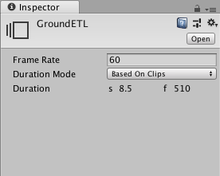

# Setting Timeline Asset properties

Use the Inspector window to set the frame rate, the duration mode, and a fixed length for the selected Timeline Asset. From the Project window, select a Timeline Asset to view its properties. 

_Inspector window when selecting a Timeline Asset in the Project window_

|**Property**||**Description**|
|:---|:---|:---|
|**Frame Rate**||Sets the reference frame rate for the Timeline Asset and its Timeline instances. Change the Frame Rate to align clips at precise frames but changing the Frame Rate is only visual and has no effect on play speed, keys, tracks, or clips.  Timeline supports the following standard frame rates: 24 (PAL), 25 (NTSC), 30, 50, and 60. Timeline also supports custom frame rates from 1e-6 to 1000.  To set a custom frame rate, enter a non-standard frame rate for the Frame Rate property. In the [Timeline Settings](tl_settings.md) menu, the Custom menu item is enabled and automatically selected for the Timeline instance. The Custom menu item shows the custom frame rate in parentheses.|
| **Duration Mode**||Choose whether the duration of the Timeline Asset extends to the end of the last clip or ends at a specific time or frame.|
||Based On Clips|Sets the length of the Timeline Asset based on the end of the last clip.|
||Fixed Length|Sets the length of the Timeline Asset to a specific number of seconds or frames.|
| **Duration**||Shows the length of the Timeline Asset in seconds and frames when the Duration Mode is set to Based on Clips.  Sets the length of the Timeline Asset to a specific number of seconds or frames when the Duration Mode is set to Fixed Length.|
