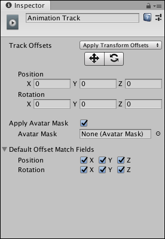

# Setting track properties

Use the Inspector window to change the name of a track and its properties. The available properties depend on the type of track selected. For example, select an Animation Track to set how track offsets are applied, to apply an avatar mask, and to select which transforms are modified when matching offsets between Animation clips.

_Inspector window when selecting an Animation track in the Timeline window_

Not all tracks have properties. See the following sections for tracks with properties:

* [Activation Track properties](insp_trk_act.md)
* [Animation Track properties](insp_trk_anim.md)

