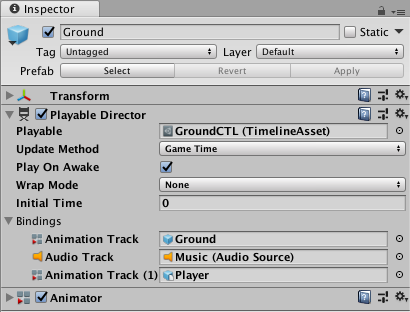

# Playable Director component

The Playable Director component stores the link between a Timeline instance and a Timeline Asset. The Playable Director component controls when the Timeline instance plays, how the Timeline instance updates its clock, and what happens when the Timeline instance finishes playing. 

_Playable Director component added to the GameObject named Ground. The GameObject is associated with the GroundCTL Timeline Asset._

The Playable Director component also shows the list of tracks from the associated Timeline Asset (**Playable** property) that animate GameObjects in the Scene. The link between Timeline Asset tracks and GameObjects in the Scene is referred to as **binding** or **Track binding**. For more on binding and the relationship between Timeline Assets and Timeline instances, see [Timeline overview](tl_about.md).

|**Property** ||**Description** |
|:---|:---|:---|
|**Playable**||Associates a Timeline Asset with a GameObject in the Scene. When you make this association, you create a Timeline instance for the selected Timeline Asset. After you create a Timeline instance, you can use the other properties in the Playable Director component to control the instance and choose which GameObjects in the Scene are animated by the Timeline Asset.|
|**Update Method**||Sets the clock source that the Timeline instance uses to update its timing.|
||DSP|Select for sample accurate audio scheduling. When selected, the Timeline instance uses the same clock source that processes audio. DSP stands for digital signal processing.|
||Game Time|Select to use the same clock source as the game clock. This clock source is affected by [time scaling](https://docs.unity3d.com/Manual/TimeFrameManagement.html).|
||Unscaled Game Time|Select to use the same clock source as the game clock, but without being affected by time scaling.|
||Manual|Select to not use a clock source and to manually set the clock time through scripting.|
|**Play on Awake**||Whether the Timeline instance is played when game play is initiated. By default, a Timeline instance is set to begin as soon as the Scene begins playback. To disable the default behaviour, disable the Play on Awake option in the Playable Director component.|
|**Wrap Mode**||The behaviour when the Timeline instance ends playback.|
||Hold|Plays the Timeline instance once and holds on the last frame until playback is interrupted.|
||Loop|Plays the Timeline instance repeatedly until playback is interrupted.|
||None|Plays the Timeline instance once.|
|Initial Time||The time (in seconds) at which the Timeline instance begins playing. The Initial Time adds a delay in seconds before the Timeline instance actually begins. For example, when Play On Awake is enabled and Initial Time is set to five seconds, if you click the Play button in the Unity Toolbar, [Play Mode](https://docs.unity3d.com/Manual/GameView.html) starts and the Timeline instance begins five seconds later.|
|**Current Time**||Views the progression of time according to the Timeline instance in the Timeline window. The Current Time field matches the Playhead Location field. Use the Current Time field when the Timeline window is hidden. The Current Time field appears in the Playable Director Component when in Timeline Playback mode or when Unity is in Game Mode.|
|**Bindings**||Shows the link between GameObjects in the Scene with tracks from the associated Timeline Asset (Playable property). The Bindings area is split into two columns: The first column lists the tracks from the Timeline Asset. Each track is identified by an icon and its track type. The second column lists the GameObject linked (or bound) to each track. The Bindings area does not list Track groups, Track sub-groups, or tracks that do not animate GameObjects. The Timeline window shows the same bindings in the [Track list](trk_list_about.md).|

