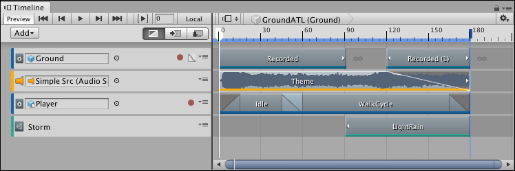
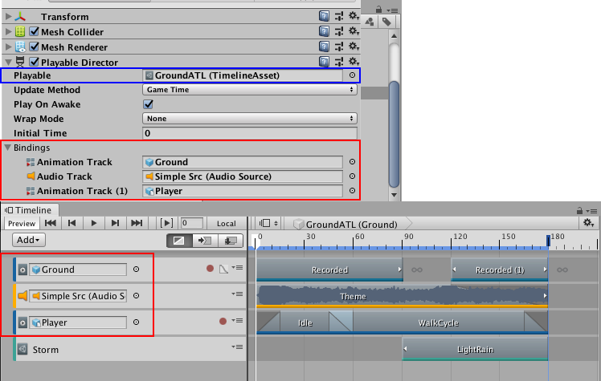
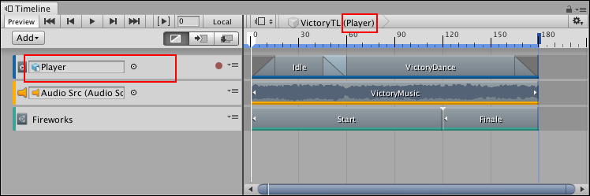
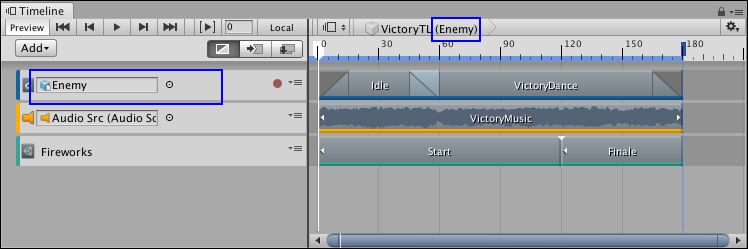

# Timeline overview

Use the **Timeline window** to create cut-scenes, cinematics, and game-play sequences by visually arranging tracks and clips linked to GameObjects in your Scene. 

_A cinematic sequence in the Timeline window._

For each cut-scene, cinematic, or game-play sequence, the Timeline window saves the following:

* **Timeline Asset**: Stores the tracks, clips, and recorded animations without links to the specific GameObjects being animated. The Timeline Asset is saved to the Project.
* **Timeline instance**: Stores links to the specific GameObjects being animated or affected by the Timeline Asset. These links, referred to as **bindings**, are saved to the Scene.

## Timeline Asset

The Timeline window saves track and clip definitions as a **Timeline Asset**. If you record key animations while creating your cinematic, cut-scene, or game-play sequence, the Timeline window saves the recorded clips as children of the Timeline Asset.

_The Timeline Asset saves tracks and clips (red). Timeline saves recorded clips (blue) as children of the Timeline Asset._

## Timeline instance

To animate a GameObject in your Scene with a Timeline Asset, you must create a **Timeline instance**. A **Timeline instance** associates a Timeline Asset with the GameObject in the Scene, through a [Playable Director](play_director.md) component. 

When you select a GameObject in a Scene that has a Playable Director component, the Timeline instance appears in the Timeline window. The bindings appear in the Timeline window and in the Playable Director component (Inspector window).

_The Playable Director component shows the Timeline Asset (blue) with its bound GameObjects (red). The Timeline window shows the same bindings (red) in the Track list._

The Timeline window provides an automated method of creating a Timeline instance while [creating a Timeline Asset](wf_instance.md).

## Reusing Timeline Assets

Because Timeline Assets and Timeline instances are separate, you can reuse the same Timeline Asset with many Timeline instances.

For example, you could create a Timeline Asset named VictoryTL with the animation, music, and particle effects that play when the main game character (Player) wins. To reuse the VictoryTL Timeline Asset to animate another game character (Enemy) in the same Scene, you can create another Timeline instance for the secondary game character.

_The Player GameObject (red) is attached to the VictoryTL Timeline Asset]_

_The Enemy GameObject (blue) is also attached to the VictoryTL Timeline Asset]_

Because you are reusing the Timeline Asset, any modification to the Timeline Asset in the Timeline window results in changes to all Timeline instances. 

For example, in the previous example, if you delete the Audio track while modifying the Player Timeline instance, the Timeline window removes the track from the VictoryTL Timeline Asset. The Timeline window also removes the Audio track from all instances of the VictoryTL Timeline Asset, including the Enemy Timeline instance.
