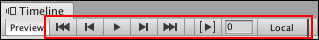
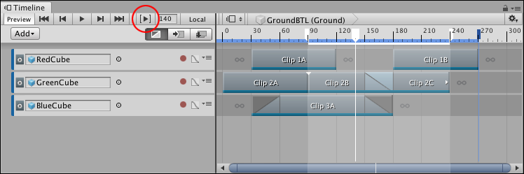
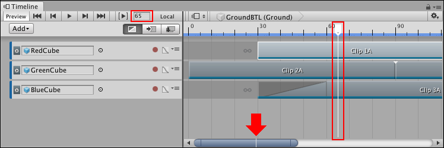
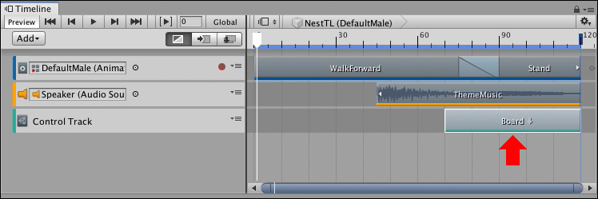
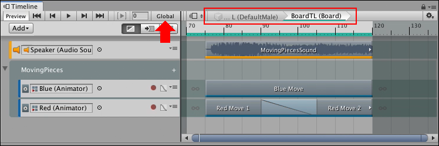
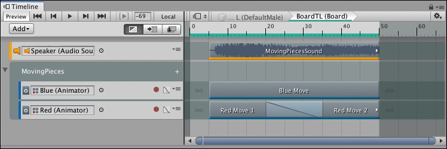
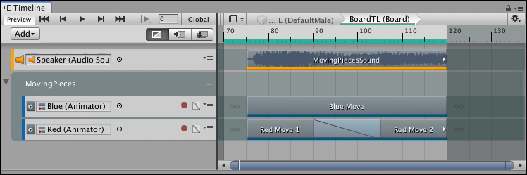

# Timeline Playback Controls

To play the Timeline instance and to control the location of the Timeline Playhead, use the Timeline Playback Controls.

_Timeline Playback Controls_

## Timeline Start button

To move the Timeline Playhead to the start of the Timeline instance, click the Timeline Start button, or hold Shift and press Comma (,).

## Previous Frame button

To move the Timeline Playhead to the previous frame, click the Previous Frame button, or press Comma (,).

## Timeline Play button

To preview the Timeline instance in Timeline Playback mode, click the Timeline Play button, or press the Spacebar. Timeline Playback mode does the following:

* Begins playback at the current location of the Timeline Playhead and continues to the end of the Timeline instance. If the Play Range button is enabled, playback is restricted to a specified time range.
* The Timeline Playhead position moves along the Timeline instance. The Playhead Location field shows the position of the Timeline Playhead in either frames or seconds, depending on the [Timeline settings](tl_settings.md). 
* To pause playback, click the Timeline Play button again, or press the Spacebar. 
* When playback reaches the end of the Timeline instance, the Wrap Mode determines whether playback should hold, repeat, or do nothing. The Wrap Mode setting is a [Playable Director component](play_director.md) property.

Timeline Playback mode provides a preview of the Timeline instance while in the Timeline window. Timeline Playback mode is only a simulation of [Play Mode in the Game View](https://docs.unity3d.com/Manual/GameView.html). 

The Timeline Playback mode does not support audio playback. To preview a Timeline instance with audio, enable the Play on Awake option in the [Playable Director component](play_director.md) and preview game play in Play Mode.

## Next Frame button

To move the Timeline Playhead to the next frame, click the Next Frame button, or press Period (.).

## Timeline End button

To move the Timeline Playhead to the end of the Timeline instance, click the Timeline End button, or hold Shift and press Period (.).

## Play Range button

Enable the **Play Range** button to restrict playback to a specific range of seconds or frames. You can only set a play range when previewing a Timeline instance within the Timeline window. Unity ignores the play range in [Play Mode](https://docs.unity3d.com/Manual/GameView.html).

The Timeline ruler highlights the play range and indicates its start and end with white markers. To modify the play range, drag either marker.

_Play Range (red circle) enabled with while markers and highlighted area defining range_

Use **Play Range Mode**, in the [Timeline Settings](tl_settings.md), to set whether the play range plays once or repeatedly.

## Timeline Playhead and Playhead Location field 

The Timeline Playhead indicates the exact point in time being previewed in the Timeline window. The Playhead Location field expresses the location of the Timeline Playhead in either frames or seconds. 

_Playhead Location field and Timeline Playhead (red). The Timeline Playhead also appears on the Zoombar (red arrow)._

Use the [Zoombar to navigate, scroll, and zoom](clp_pan_zoom.md) the Clips view. A white line indicates the location of the Timeline Playhead in relation to the entire Timeline instance.

To jump the Timeline Playhead to a specific time, click the Timeline ruler. You can also enter the time value in the Playhead Location field and press Enter. When entering a value, frames are converted to seconds or seconds are converted to frames, based on the Timeline settings. For example, if the Timeline ruler is expressed as seconds with a frame rate of 30 frames per second, entering 180 in the Playhead Location field converts 180 frames to seconds and moves the Timeline Playhead to 6:00. To set the time format that the Timeline window uses, configure the [Timeline Settings](tl_settings.md).

## Switching between Local and Global

Use the Local or Global button to change the Timeline ruler from local time to global time. Local time and global time are only relevant when editing a nested Timeline instance. 

[To create a nested Timeline instance](wf_nested.md), drag a GameObject associated with a Timeline instance into another Timeline instance. The Timeline instance you are dragging into becomes the master Timeline instance. The Timeline instance associated with the GameObject becomes a nested Timeline instance.

_A nested Timeline instance appears as a Control clip on a Control track (red arrow)_

To edit a nested Timeline instance, double-click the Control clip that contains the nested Timeline instance. The Timeline window switches to the nested Timeline instance, indicated by the Timeline title which shows the name and GameObject of the master Timeline instance, followed by the name and GameObject of the nested Timeline instance.

_The Timeline title indicates that you are editing a nested Timeline instance (red outline). The Global button (red arrow) indicates that the nested Timeline instance is shown using global time._

When editing a nested Timeline instance, click **Global** to switch the Timeline ruler to Local time. Local time is relative to the nested Timeline. This means that the Timeline ruler starts at zero.

_A nested Timeline instance in Local time._

Click **Local** to view the Timeline ruler in relation to the placement of the nested Timeline in the master Timeline instance. This means that if, for example, if the Control clip is placed at frame 70 of the master Timeline then the Timeline ruler starts at 70 at the beginning of the nested Timeline instance.

_A nested Timeline instance in Global time._

