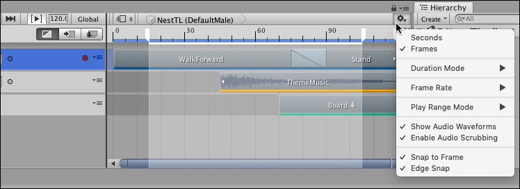
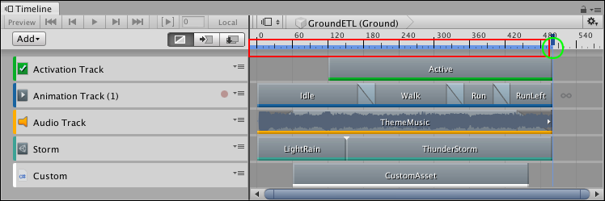
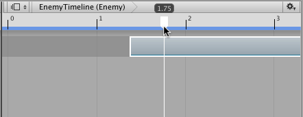

# Timeline Settings

Use the Timeline Settings to choose the Timeline window and Timeline Asset settings such as the unit of measurement, the duration mode, audio waveform, and window snap settings.

_Click the Cog icon in the Timeline window to view the Timeline Settings menu_

## Seconds or Frames

Select either **Seconds** or **Frames** to set the Timeline window to display time as either seconds or frames.

## Duration Mode

Use the **Duration Mode** to set whether the duration of the Timeline Asset extends to the end of the last clip (**Based On Clips**), or ends at a specific time or frame (**Fixed Length**). When the **Duration Mode** is set to **Fixed Length**, use one of the following methods to change the length of the Timeline Asset:

* Select the Timeline Asset in the Project window and use the Inspector window to set the Duration in seconds or frames. 
* In the Timeline window, drag the blue marker on the timeline. The blue marker indicates the end of the Timeline Asset. A blue line indicates the duration of the Timeline Asset.

_Timeline Asset duration (red rectangle) and end marker (green circle)_

## Frame Rate

Select one of the options under **Frame Rate** to set the unit of measurement for the Timeline ruler. Change the Frame Rate to align clips at precise frames but changing the Frame Rate is only visual and has no effect on play speed, keys, tracks, or clips. The following standard frame rates are listed: Film (24 fps), PAL (25 fps), NTSC (29.97 fps), 30, 50, or 60.

Timeline supports custom frame rates from 1e-6 to 1000. To set a custom frame rate, you must use the **Frame Rate** property in the [Timeline Asset settings](insp_tl.md). When the Timeline Asset is set to a custom frame rate, the Custom menu item is enabled and is automatically selected for the Timeline instance. The Custom menu item shows the custom frame rate in parentheses.

## Play Range Mode

Select one of the options under **Play Range Mode** to set the behaviour of the Timeline window when the [Play Range button](tl_play_cntrls.md#playrange) is enabled.

* When **Play Range Mode** is set to **Loop**, the Timeline instance plays the defined Play Range repeatedly, until playback is interrupted.
* When **Play Range Mode** is set to **Hold**, the Timeline instance plays the defined Play Range once and stops at the end of the Play Range.

You can only set a play range when previewing a Timeline instance within the Timeline window. Unity ignores the play range in [Play Mode](https://docs.unity3d.com/Manual/GameView.html). 

## Show Audio Waveforms

Enable **Show Audio Waveforms** to draw the waveforms for all audio clips on all audio tracks. For example, use an audio waveform as a guide when manually positioning an Audio clip of footsteps with the Animation clip of a humanoid walking. Disable **Show Audio Waveform** to hide audio waveforms. **Show Audio Waveforms** is enabled by default.

## Enable Audio Scrubbing

**Enable Audio Scrubbing** to play audio while dragging the Timeline Playhead. 

Disable **Enable Audio Scrubbing** to stop playing audio while dragging the Timeline Playhead. When disabled, Timeline only plays audio when in [Timeline Playback mode](tl_play_cntrls.md#playbutton).

## Snap to Frame

Enable **Snap to Frame** to manipulate clips, preview Timeline instances, drag the Timeline Playhead, and position the Timeline Playhead using frames. Disable **Snap to Frame** to use subframes. **Snap to Frame** is enabled by default.

_Disable **Snap to Frame** to position clips and drag the playhead between frames_

For example, when **Snap to Frame** is disabled and you drag the Timeline Playhead, it moves the playhead between frames. The format of [Playhead Location](tl_play_cntrls.md#playheadlocation) displays differently depending on whether the Timeline window is set to **Seconds** or **Frames**:

* When the Timeline window is set to **Frames**, the Playhead Location shows frames and subframes. For example, 8 frames and 34 subframes displays as 8.34.
* When the Timeline window is set to **Seconds**, the Playhead Location shows seconds, frames, and subframes. For example, 6 seconds, 17 frames, and 59 subframes displays as 6:17 [.59].

Manipulating clips, previewing Timeline instances, and positioning the playhead at the subframes level is useful when attempting to synchronize animation and effects with audio. Many high-end audio processing software products create audio waveforms with subframe accuracy. 

## Edge Snap

Enable the **Edge Snap** option to snap clips when you position, trim, and create blends. 

When enabled, the Timeline window snaps the start or end of a clip when dragged within 10 pixels of the Timeline Playhead, the start or end of a clip on the same track, the start or end of a clip on another track, or the start or end of the entire Timeline instance. The start guide or end guide is redrawn in white to indicate that the clip has snapped to the edge of another clip or the Timeline Playhead.

Disable **Edge Snap** to create more accurate blends, ease-ins, or ease-outs. **Edge Snap** is enabled by default.
