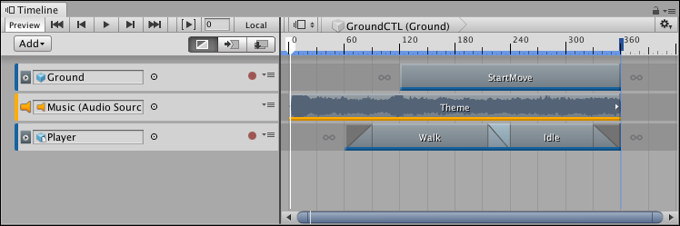
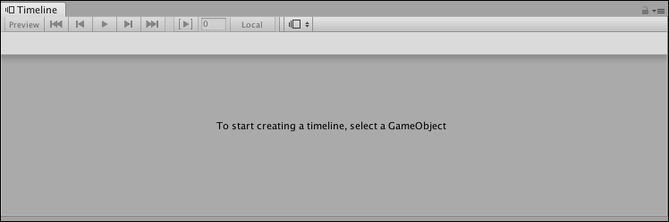
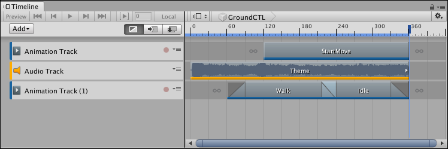

# Timeline window

To access the Timeline window, select **Sequencing** &gt; **Timeline** from the Window menu. What the Timeline window shows depends on what you select in either the Project window or the Scene view. 

For example, if you select a GameObject that is associated with a Timeline Asset, the Timeline window shows the tracks and clips from the Timeline Asset and the GameObject bindings from the Timeline instance.

_Selecting a GameObject associated with a Timeline Asset displays its tracks and clips, and the bindings from the Timeline instance_

If you haven’t selected a GameObject, the Timeline window informs you that the first step for creating a Timeline Asset and a Timeline instance is to select a GameObject.

_With no GameObject selected, the Timeline window provides instructions_

If a GameObject is selected and it is not associated with a Timeline Asset, the Timeline window provides the option for creating a new Timeline Asset, adding the necessary components to the selected GameObject, and creating a Timeline instance.

_Select a GameObject that is not associated with a Timeline Asset to create a new Timeline Asset, add components, and create a Timeline instance_

To use the Timeline window to view a previously created Timeline Asset, select the Timeline Asset in the Project window and open the Timeline window. The Timeline window shows the tracks and clips associated with the Timeline Asset, but without the track bindings to GameObjects in the Scene. In addition, the Timeline Playback Controls are disabled and there is no Timeline Playhead.

 

_Timeline Asset selected in the Project window shows its tracks and clips, but with no track bindings. The Timeline Playback Controls are disabled._

Timeline saves the track bindings to GameObjects in the Scene with the Timeline instance, not the Timeline Asset. For details on the relationship between the Project, Scene, Timeline Assets, and Timeline instances, see [Timeline overview](tl_about.md).
