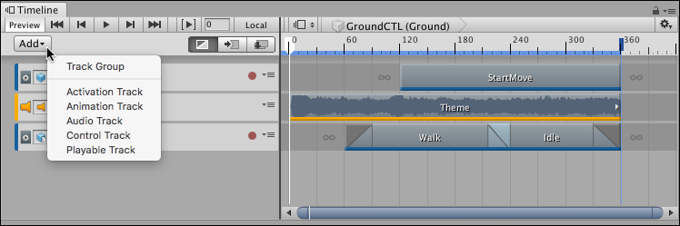

# Adding tracks

The Timeline window supports many different methods of adding tracks to the Track list. Depending on the method you choose, the Timeline window may also add track bindings to the Track header, clips to tracks, and components to GameObjects.

_Add Track menu_

The simplest method to add a track is to click the **Add** button and select the type of track from the **Add Track** drop-down menu. You can also right-click an empty area of the Track list to make the **Add Track** menu appear.

The Timeline window also supports dragging a GameObject into the Track list. Drag a GameObject into an empty area in the Track list and select the type of track to add from the context menu. Depending on the type of track selected, the Timeline window performs different actions:

* Select **Animation Track** and the Timeline window binds the GameObject to the Animation track. If the GameObject doesn't already have an Animator component, the Timeline window creates an Animator component for the GameObject.
* Select **Activation Track** and the Timeline window binds the GameObject to the Activation track. There are some limitations when creating an Activation track when dragging a GameObject. For example, the main GameObject with the Playable Directory component should not be bound to an Activation track. Because this is the same GameObject that links the Timeline Asset to the Scene, activating and disabling the GameObject affects the length of Timeline instance.
* Select **Audio Track** and the Timeline window adds an Audio Source component to the GameObject and binds this Audio Source component to the Audio track.
