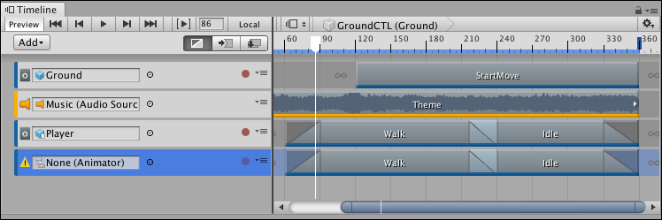

# Duplicating tracks

Duplicating a track copies its clips, blends, and Inspector properties. If the duplicated track is bound to a GameObject, the binding is reset to **None**.

_Track binding for a duplicated track is reset to **None**_

There are many ways to duplicate tracks:

* Select a track. Right-click an empty area in the Track list and select **Duplicate** from the context menu.
* Select a track. Hold Command/Control and press D.
* Select a track. Hold Command/Control and press C, for copy, then press V, for paste.
* Right-click a track and either select **Duplicate** from the context menu or hold Command/Control and press D. 
