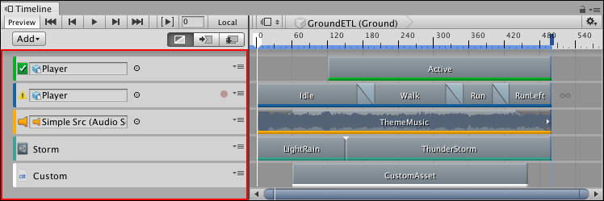
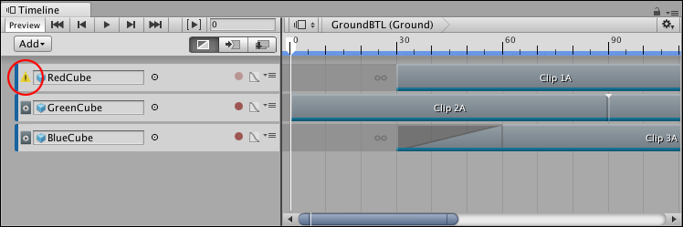

# Track list and Track headers

Use the Track list to add, select, duplicate, delete, lock, mute, and reorder the tracks that comprise a Timeline Asset. You can also organize tracks into Track groups.

_Track list and Track headers for the Timeline instance named GroundETL_

Each track has two areas: 

* Track list: Shows a Track header for each track. 
* Clips view: Shows the clips for each track. 

The Track header contains the name of the track or its binding information. Track bindings are saved to the Playable Director component associated with the GameObject that is linked to the Timeline Asset. This association is referred to as a **Timeline instance** (see [Timeline overview](tl_about.md)).

Each Track header has a colored accent that identifies the track type and its clips:

* Activation tracks are green. Use Activation tracks to add Activation clips which set when the bound GameObject is active (shown). The GameObject is bound to the Activation track.
* Animation tracks are blue. Use Animation tracks to add Animation clips that animate the bound GameObject. Use an Animation track and its Animation clips to [record basic animation](wf_rec_anim.md) or [animate a humanoid](wf_char_anim.md). 
* Audio tracks are orange. Use Audio tracks to add Audio clips for playing background music or sound effects. Each Audio clip is bound to an audio waveform. The audio source, that plays each waveform, is bound to the Audio track.
* Control tracks are turquoise. Use Control tracks to add Control clips which are special clips that control a nested Timeline instance, Particle System, Prefab instance, or ITimeControl Script. [How the Control clip is created](insp_clp_ctrl_com.md) determines what it controls.
* Playable tracks are white. Use Playable tracks to add Playable clips. Each Playable clip is bound to a script that uses the [Playables API](https://docs.unity3d.com/Manual/Playables.html) to create custom animation tools, effects or gameplay mechanisms.

Each Track header is also identified by an icon. If a track has a binding error or if the bound GameObject is disabled, the icon representing a track changes to an alert icon. For example, if an Animation track is bound to a GameObject that is disabled at the location of the Playhead, the icon switches to an alert icon.

_An alert icon indicates that the RedCube bound GameObject is disabled at the start of the Timeline instance_

