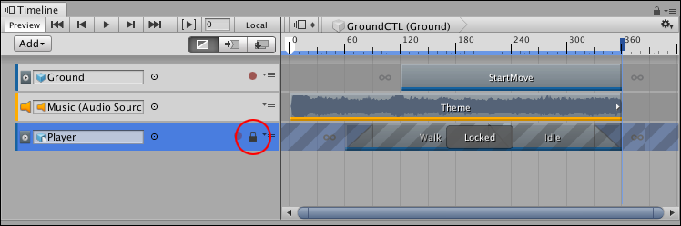

# Locking tracks

Lock a track to prevent editing of the track and any of the clips used by the track.

Use lock when you have finished animating a track and you want to avoid inadvertently modifying the track. You cannot edit or delete a locked track, or select its clips. The Lock icon identifies a locked track.

_Selected and locked track with Lock icon (red circle)_

To lock a track, right-click on the track and select **Lock** from the context menu. You can also select a track and press L. You can select and lock multiple tracks at a time. A track can be both locked and muted.

To unlock a track, click the Lock icon. You can also select a locked track and press L, or right-click and select **Unlock**.
