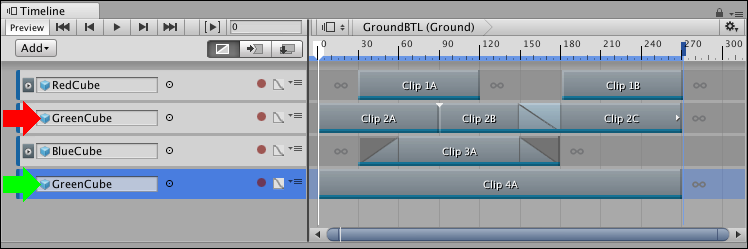
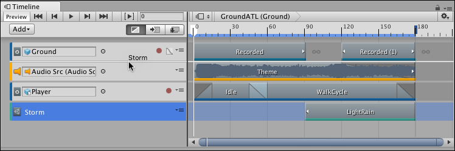

# Reordering tracks and rendering priority

In the Timeline window, the rendering and animation priority is from the last track to the first track, where the last track takes priority. You can reorder tracks to change their rendering or animation priority.

For example, a Timeline instance has four Animation tracks, where the second and fourth Animation tracks animate the same GameObject. The fourth track overrides the animation on any of the preceding tracks. This animation priority is the reason why Animation Override tracks are added as child tracks, under Animation tracks.

_The second track (red arrow) and fourth track (selected, green arrow) animate the same GameObject (GreenCube). The fourth track has priority and overrides the second track.)_

To reorder tracks, select one or more tracks and drag until a white insert line appears between tracks in the Track list. The white insert line indicates the destination of the tracks you are dragging. The last selected track type displays beside the cursor. Release the mouse button to reorder tracks.

_For example, the white insert line indicates that the Control track (Storm) will be placed between the first track (Ground) and second track (Audio Src)_

An Animation Override track is bound to the same GameObject as its parent Animation track. Reordering an Animation Override track converts it to an Animation track and resets its binding to none.
