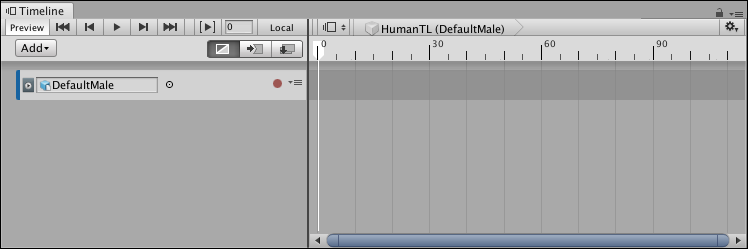
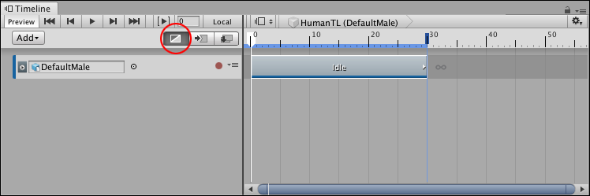
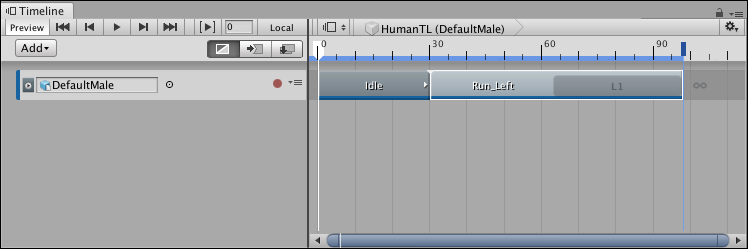
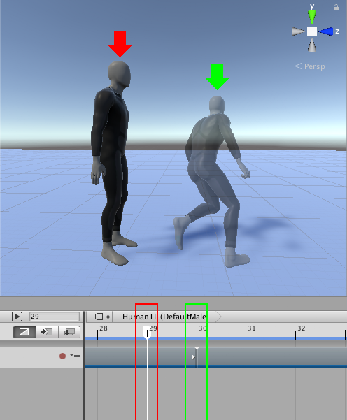
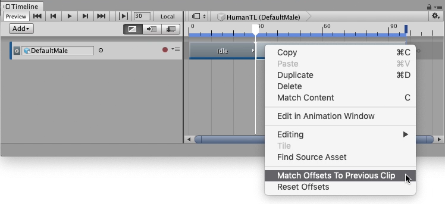
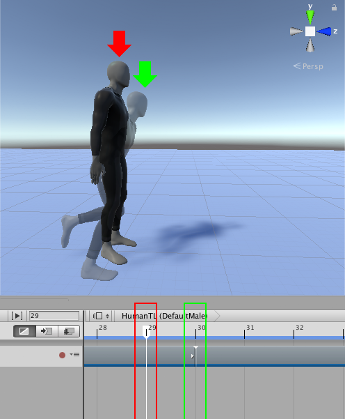
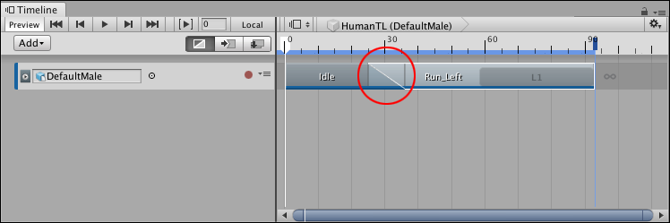
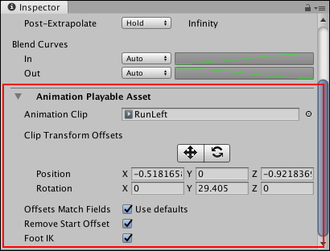
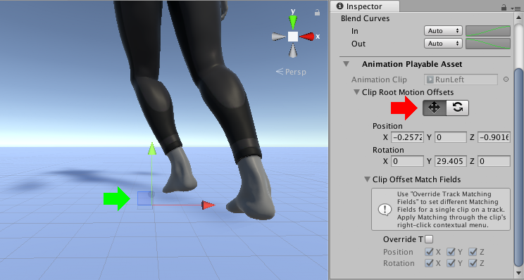

# Animating a humanoid

This task demonstrates how to use a Timeline instance to animate a humanoid with external motion clips. This workflow also demonstrates how to match clip offsets, manually adjust clip offsets, and create blends between clips to minimize jumping and sliding. Although this workflow uses a humanoid, you can use this animation method for any GameObject.

This workflow assumes that you have already created a Timeline instance with an empty Animation track bound to a humanoid. For example, the DefaultMale humanoid is bound to an empty Animation track:

_DefaultMale humanoid bound to an empty Animation track._

From your Project, drag a motion clip into the Animation track to create a new Animation clip. For example, drag an idle pose as the first clip to start the humanoid from an idle stance. 

To position, resize, or trim your Animation clip in the Clips view, select **Mix mode** as the Clip Edit mode. There are [three different Clip Edit modes](clp_about.md) that change the editing behaviour of the Timeline window. When the Timeline window is in **Mix mode**, you can drag and trim clips to create blends.

_Animation track, bound to the DefaultMale humanoid, with an idle pose (Idle) as its Animation clip. The Mix mode (red circle) is the selected Clip Edit mode._

Add a second Animation clip. This example adds a run and turn left clip (named Run_Left)  to the Animation track, and then resizes the clip to include one loop, so the DefaultMale runs and turns 180 degrees.

_Animation track with an Idle clip and a Run_Left clip_

Play the Timeline instance. In this example, the DefaultMale humanoid jumps between each Animation clip because the position of the humanoid at the end of the first Animation clip (Idle) does not match the position of the humanoid at the start of the next Animation clip (RunLeft).

_The humanoid jumps between the first Animation clip, which ends at frame 29 (red arrow and box), and the second Animation clip, which starts at frame 30 (ghost with green arrow and box)_

## Matching clips

To fix the animation jump between clips, match the offset of each Animation clip. The Timeline window provides [different methods for matching offsets](clp_match.md). In this example, Timeline matches the second Animation clip with the previous clip. To do this, select the Run_Left clip, right-click and select **Match Offsets to Previous Clip**.

_Right-click and select Match Offsets to Previous Clip to match the offsets of the selected Animation clip with the preceding Animation clip_

_After matching offsets, the position and rotation of the humanoid at the start of the second Animation clip (frame 30, ghost with green arrow) matches the position and rotation of the humanoid at the end of the first Animation clip (frame 29, red arrow)_

Play the Timeline instance again. Although the position and rotation of the humanoid matches, there is still a jump between the two Animation clips because the humanoid is in different poses. At the end of the first Animation clip, the humanoid is standing upright with its feet together. At the start of the second Animation clip, the humanoid is bent forward with its feet apart.

## Blending clips

[Create a blend](clp_blend.md) to remove the jump and transition between the two poses. Adjust the size of the clips, the Blend Area, the Clip In, and the shape of each Blend Curve to create a transition between the two poses. For example, in the transition between the Idle clip and the Run_Left clip, the Idle clip was resized to 36 frames and the Run_Left clip was repositioned to start at frame 25. The rest of the clip properties are unchanged from their default values.

_With Mix mode selected, you can create a blend (red circle) between two clips to create a smooth transition between two animations._

As the Idle clip transitions to the Run_Left clip, the blend removes the obvious jump between poses. The transition between most body parts appears natural, however in this example, the blend between the different positions of the foot results in an unnatural foot slide.

## Reducing foot slide

To reduce foot sliding, manually adjust the offset of an Animation clip so that the position of the foot changes less drastically. To manually adjust the offset, select the Animation clip in the Timeline window. In the Inspector window, expand **Animation Playable Asset**.

_Select an Animation clip. In the Inspector window, expand **Animation Playable Asset** (red) to view the **Clip Transform Offsets**._

The rotation and position **Clip Transform Offsets** are not zero because performing **Match Offsets to Previous Clip** already set these values to match the root (hips) of the humanoid at the end of the previous Animation clip.

Under **Clip Transform Offsets**, enable the Move tool. The Move Gizmo appears in the Scene view, at the root of the Animation clip. 

_Enable the Move tool (Inspector window, red arrow) to show the Move Gizmo (green arrow) in the Scene view_

Use one of the following methods to manually adjust the offset position of the Animation clip:

* In the Scene view, drag the Move Gizmo.
* In the Inspector window, under **Clip Transform Offsets**, change the value of the appropriate **Position** property.

