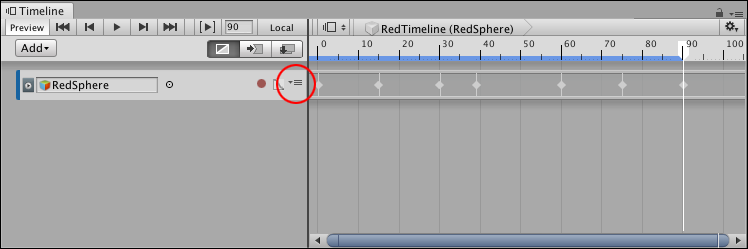
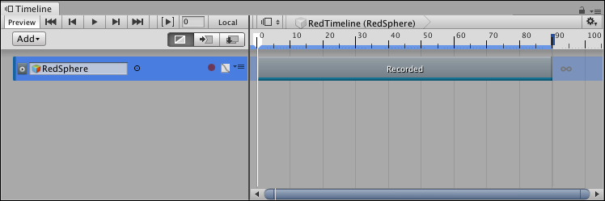

# Converting an Infinite clip to an Animation clip

An Infinite clip appears as a dope sheet. An Infinite clip cannot be positioned, trimmed, or split because it does not have a defined duration. To position, trim, split, or perform other clip manipulations on an Infinite clip, you must first convert it to an Animation clip. You cannot convert an Animation clip back to an Infinite clip.

To convert an Infinite clip to an Animation clip, click the Track menu icon and select **Convert to Clip Track**: 

_The Track menu (circled) converts an Infinite clip to an Animation clip._

You can also right-click the track and select **Convert to Clip Track** from the context menu. The Track menu and context menu are the same.

_An infinite clip after it has been converted to an Animation clip_

