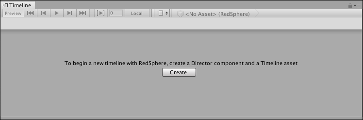

# Creating a Timeline Asset and Timeline instance

To use a Timeline Asset in your Scene, associate the Timeline Asset with a GameObject using a [Playable Director](play_director.md) component. Associating a Timeline Asset with a Playable Director component creates a Timeline instance and allows you to specify which objects in the Scene are animated by the Timeline Asset. To animate a GameObject, it must also have an [Animator](https://docs.unity3d.com/Manual/class-Animator.html) component.

The Timeline window automatically creates a Timeline instance while creating a new Timeline Asset. The Timeline window also creates the necessary components.

To create a new Timeline Asset and Timeline instance, follow these steps:

1. In your Scene, select the GameObject that you want to use as the focus of your cinematic or other gameplay-based sequence.
2. Open the Timeline window (menu: **Window** &gt; **Sequencing** &gt; **Timeline**). If the GameObject does not yet have a Playable Director component attached to a Timeline Asset, a message in the Timeline window prompts you to click the **Create** button.
3. Click **Create**. A dialog box prompts you for the name and location of the Timeline Asset you are creating. You can also specify tags to identify the Timeline Asset.
4. Click **Save**.

 

The Timeline window does the following: 

* Saves a new Timeline Asset to the Assets directory of your Project. If you did not change the name and location of the Timeline Asset you are creating, the Timeline window creates a name based on the selected GameObject with the "Timeline" suffix. For example, selecting the GameObject called "Enemy" names the Asset "EnemyTimeline".
* Adds an empty Animation track to the Timeline Asset.
* Adds a Playable Director component to the selected GameObject, and sets the **Playable** property to the Timeline Asset. This creates a Timeline instance.
* Sets the binding on the Animation track in the Playable Director component to the selected GameObject. The Animation track does not have any clips, so the selected GameObject is not animated.
* Adds an Animator component to the selected GameObject. The Animator component animates the GameObject through the Timeline instance. The GameObject cannot be animated without an Animator component.
