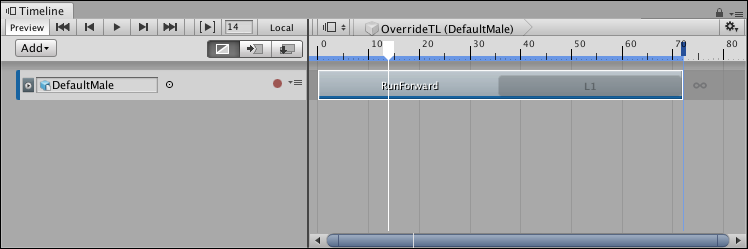
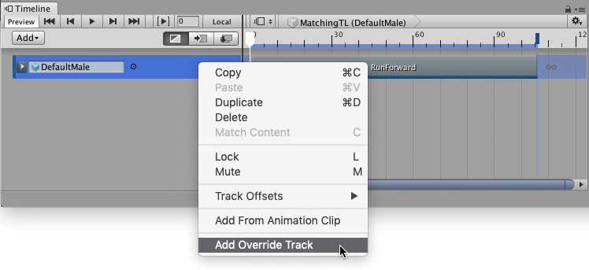
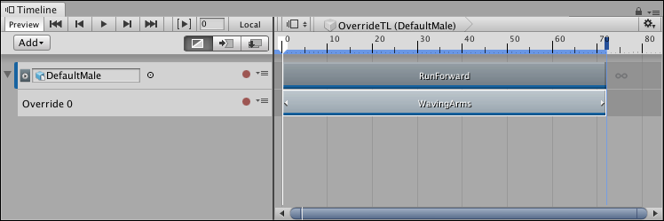
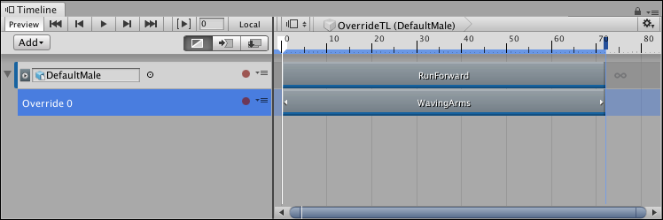
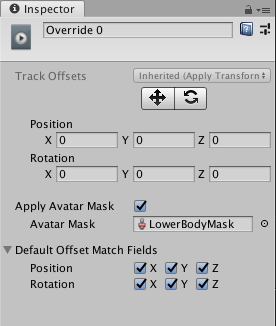
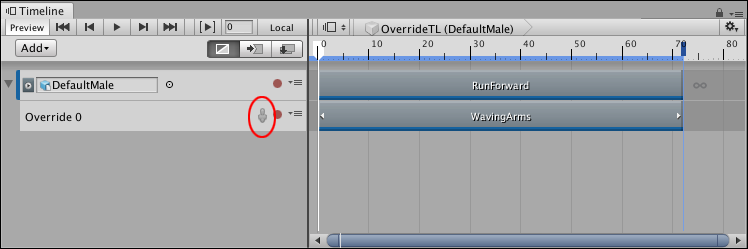

# Using an Animation Override track and an Avatar Mask

This task demonstrates how to use an Animation Override track and an Avatar Mask to replace the upper-body animation of an Animation track. Use this technique to animate a humanoid to, for example, run and carry an object. For information on creating an Avatar mask, see [Avatar Mask window](https://docs.unity3d.com/Manual/class-AvatarMask.html). 

This task assumes that you have already [created a Timeline instance](wf_instance.md) with a simple Animation clip on an Animation track bound to a humanoid:

_This example uses a humanoid bound to a simple run cycle animation (RunForward) that loops once_

Right-click the Animation track and select **Add Override Track** from the context menu. An Animation Override track, named Override 0, is linked to the selected Animation track. Notice that the Animation Override track is not bound to a GameObject. Because the Override track is linked to the Animation track above, the Override track is bound to the same GameObject, in this case, the DefaultMale humanoid.

_To add an Override track, right-click the Animation track and select Add Override Track from the context menu]_

From your Project, drag an Animation Clip with upper-body animation into the Override track. For example, drag an animation of a humanoid standing still and waving their arms. Position and resize the clip to match the Animation clip that you want to override.

_The Animation Override track contains an Animation clip of a humanoid standing still, waving their arms (WavingArms). This clip was resized to match the Animation clip (RunForward) of the parent Animation track._

Play the Timeline instance. In this example, the WavingArms clip completely overrides the RunForward clip. To combine the lower-body animation from one Animation clip with upper-body animation from another Animation clip, specify an Avatar Mask for the Animation Override track.

_To specify an Avatar Mask, select the Override track to view its properties in the Inspector window_

From the Project, drag an Avatar Mask, that masks the lower body animation, into the Avatar Mask property in the Inspector window. Enable the **Apply Avatar Mask** checkbox. An Avatar Mask icon appears beside the track name.

_An Avatar Mask, that masks the lower body animation, is specified for the Animation Overview clip in the Inspector window. This allows the upper body animation to pass through._

_The Avatar Mask icon (red) indicates that the Animation Override track uses an Avatar Mask._

Play the Timeline instance. In this example, the DefaultMale humanoid uses upper-body animation from the WavingArms clip and lower-body animation from the RunForward clip. To temporarily disable the Avatar Mask, click the Avatar Mask icon.

_The Avatar Mask icon (red) is gray when disabled. The WavingArms clip completely overrides the RunForward clip._

