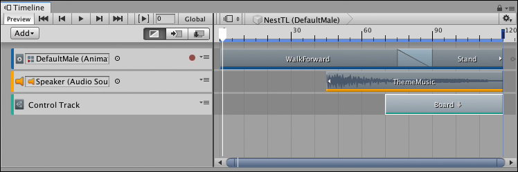
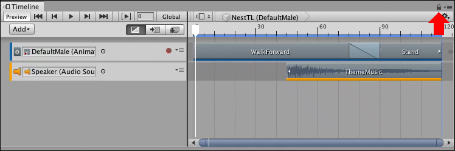
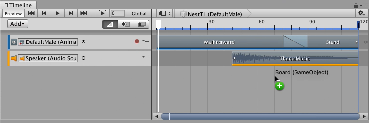
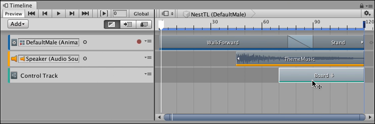
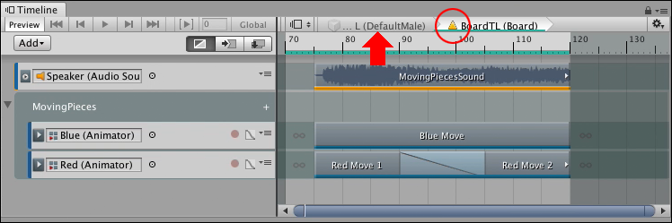
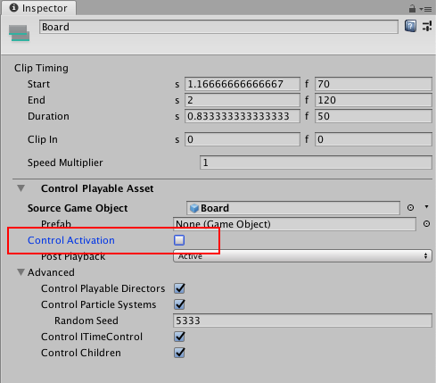

# Nesting Timeline instances

Timeline supports nesting Timeline instances. A nested Timeline instance refers to a Timeline instance that is added within another Timeline instance. The **master Timeline instance** refers to the main or parent Timeline instance that includes other Timeline instances.

Nesting Timeline instances is useful if you have a large team working on different aspects of a Project and you want them to collaborate on the same cinematic or cut-scene.

For example, you are developing a puzzle game that starts with a cinematic of the character walking into frame while the pieces on the game board move into position. You could create a master Timeline instance for the character walking into frame. You could create another Timeline instance for the game board animation. You could then nest the game board animation into the master Timeline instance of the character walking into frame.

_The master NestTL Timeline instance has a character walking and theme music. A Control track nests the BoardTL Timeline instance for the game board animation._

By creating a master Timeline instance with nested Timeline instances, different teams can work on different animations and then combine the animations into one master Timeline. In the puzzle game example, one team could work on the character Timeline instance, and another team could work on the game board animation.

When you have two Timeline instances, and you want to nest one instance into the other, open the Timeline instance that you want to be the master Timeline instance. To ensure that the Timeline window does not switch while you select GameObjects, click the lock icon (red arrow):

_The master NestTL Timeline instance has a character walking and theme music._

Find the GameObject in your Scene that is associated with the Timeline instance that you want to nest inside the master Timeline instance. Drag the GameObject into the Clips view of the Timeline window. 

_The Board GameObject is associated with the BoardTL Timeline instance. Drag the Board GameObject into the NestTL master Timeline to nest the BoardTL Timeline instance in the NestTL Timeline instance._

The Timeline window creates a Control track and places the Control clip where you drop the GameObject. The Control clip is set to the same size as the Timeline instance. When a Control clip contains a nested Timeline instance, a downward arrow appears beside its name. To edit a nested Timeline instance from the master timeline, double-click its Control clip.

_Double-click the Control clip to edit the nested BoardTL Timeline instance from within the master_

A warning icon appears beside the name of the nested Timeline instance because the Timeline Playhead is outside the range of the nested Timeline. Timeline also disables the Timeline Playhead controls.

When you edit a nested Timeline instance, you cannot change the duration of the nested Timeline instance. You must return to the master Timeline instance and change the duration of the Control clip to change the duration of the nested Timeline instance. To return to the master, click the name of the master Timeline instance (red arrow): 

_Warning icon (red circle) means the Timeline Playhead Controls are disabled._

The Timeline window is in this state because, by default, the size of the Control clip in the master Timeline instance determines when the nested Timeline instance is active. Use one of the following methods to change this state and edit the nested Timeline instance:

* Click the Timeline ruler to move the Timeline Playhead into the nested Timeline. This enables editing and the Timeline Playback Controls.
* In the master Timeline instance, move the Timeline Playhead to within the Control clip before you double-click the Control clip.
* In the master Timeline instance, select the Control clip, and disable the Control Activation property in the Inspector window. 

_Disable the Control Activation property (red outline) to have the nested Timeline instance active throughout the duration of the master Timeline instance._

