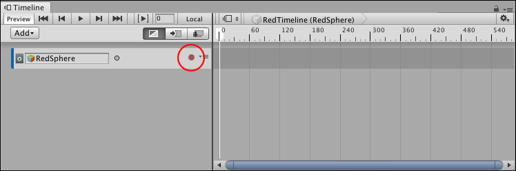
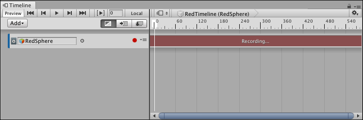
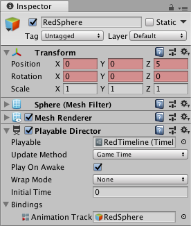
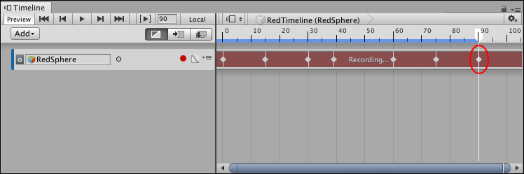
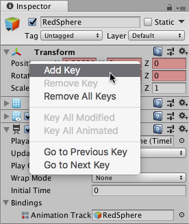
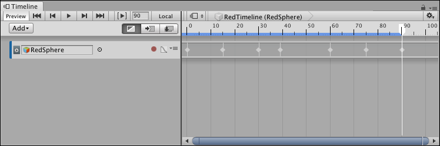
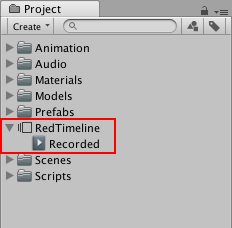

# Recording basic animation with an Infinite clip

You can record animation directly to an Animation track. When you record directly to an empty Animation track, you create an **Infinite clip**.

An Infinite clip is a clip that contains basic key animation recorded through the Timeline window. An Infinite clip cannot be positioned, trimmed, or split because it does not have a defined size: it spans the entirety of an Animation track. 

Before creating an Infinite clip, you must [add an empty Animation track](trk_add.md) for the GameObject that you want to animate.

In the Track list, click the red circular Record button for the empty Animation track to enable Record mode. 

 

_Click the Record button on an empty track to enable Record mode_

When a track is in Record mode, the clip area of the track is drawn in red with the "Recording..." message, and the Record button blinks on and off.

_Timeline window in Record mode_

When in Record mode, any modification to an animatable property of the GameObject sets a key at the location of the Timeline Playhead. 

To start creating an animation, move the Timeline Playhead to the location of the first key, and do **one** of the following: 

* In the Inspector window, right-click the name of the property and choose **Add Key**. This adds an animation key for the property without changing its value. A diamond appears in the Infinite clip to show the position of the key.
* In the Inspector window, change the value of the animatable property of the GameObject. This adds an animation key for the property with its changed value. A diamond appears in the Infinite clip.
* In the Scene view, either move, rotate, or scale the GameObject. This automatically adds a key for the properties you change. A diamond appears in the Infinite clip.

_Red background indicates that you’ve added an animation curve for the property to the clip_

_Setting a key adds a diamond to the Infinite clip_

Move the playhead to a different position on the Timeline and change the animatable properties of the GameObject. At each position, the Timeline window adds a diamond to the Infinite clip for any changed properties and adds a key to its associated animation curves. 

While in Record mode, you can right-click the name of an animatable property name to perform keying operations such as setting a key without changing its value, jumping to the next or previous keys, and removing keys. For example, to set a key for the position of a GameObject without changing its value, right-click **Position** and select **Add Key** from the context menu.

 

_Right-click the name of an animatable property to perform keying operations_

When you finish the animation, click the blinking Record button to disable Record mode.

An Infinite clip appears as a dope sheet in the Timeline window, but you cannot edit the keys in this view. Use [the Curves view to edit keys](crv_keys_edit.md). You can also double-click the Infinite clip and edit the keys with the Animation window. 

_An Infinite clip appears as a dope sheet_

Save the Scene or Project to save the Timeline Asset and the Infinite clip. The Timeline window saves the key animation from the Infinite clip as a source asset. The source asset is named "Recorded" and saved as a child of the Timeline Asset in the Project. 

_Recorded clips are saved under the Timeline Asset in the Project_

For every additional recorded Infinite clip, the Timeline window numbers each clip sequentially, starting at "(1)". For example, a Timeline Asset with three recorded Infinite clips are named "Recorded", "Recorded (1)", and "Recorded (2)". If you delete a Timeline Asset, its recorded clips are also removed.

