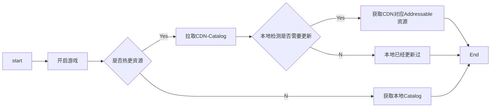
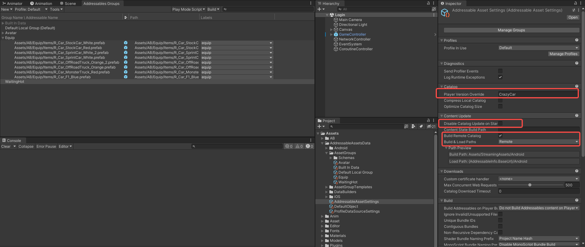
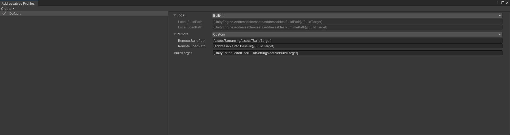
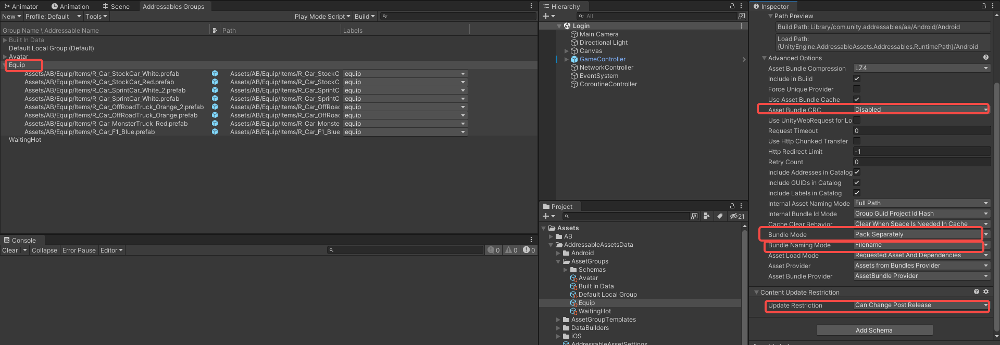
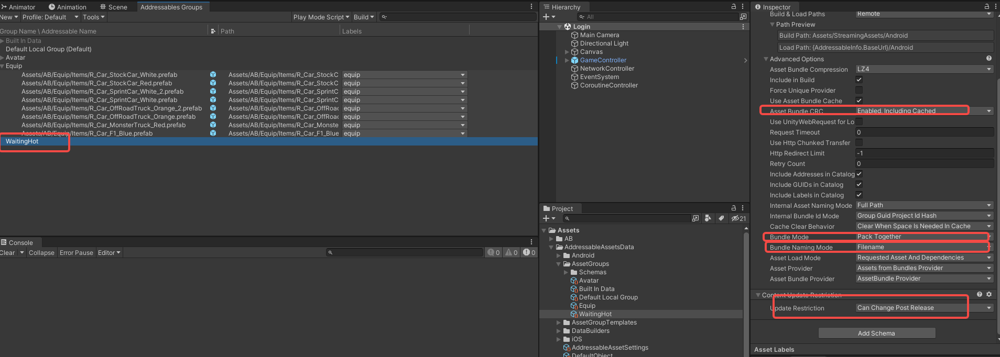

# 资源热更新方案设计

**Addressable**可以理解为是在Asset Bundle的基础上，提供了一个管理系统可以让我们更好的组织和管理我们的资源。

**Addressable**的本质是Unity想要主推的**CCD**(*资源流式分发*)的技术基础，所以它的更新方案偏重于线上更新，对于一般游戏并不适应。

对于一般游戏的诉求如下：正常情况新装备可以随新版本一同发行，此时不希望通过资源更新的方式获取新装备；但是如果线上装备贴图错误或者有活动装备需要紧急上新，都是需要能够单独热更，即只更新此装备；以上为产品诉求，但是对于开发来说，不希望在装备随版本一同发行的情况下，还要再打一个资源包发至CDN，只希望真正更新资源时再从线上拉取catalog判断是否需要更新资源。

基于以上诉求设计Addressable更新方案：

基于以上方案，需要在Addressable调整的参数如下：

