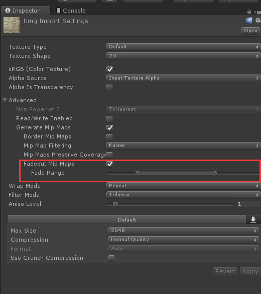
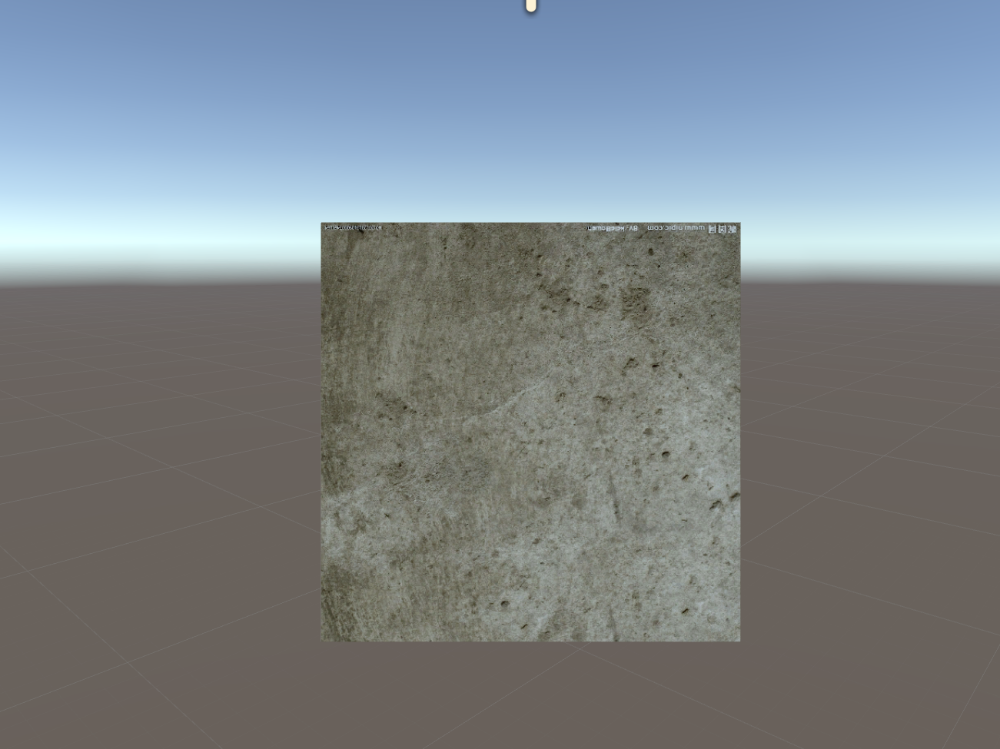
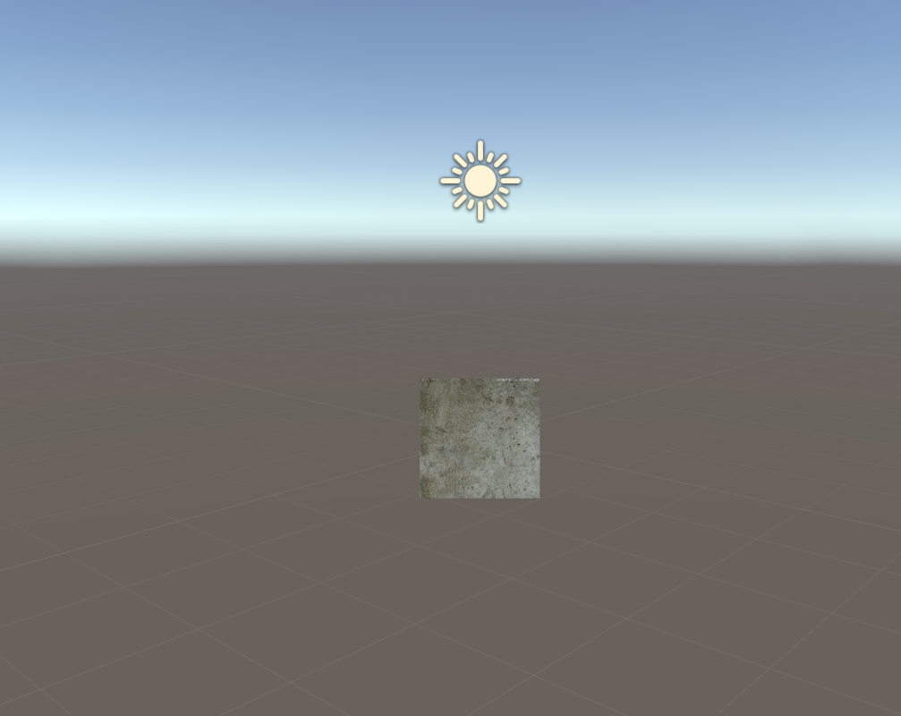
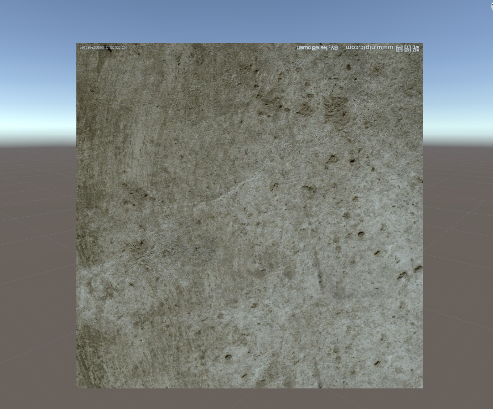
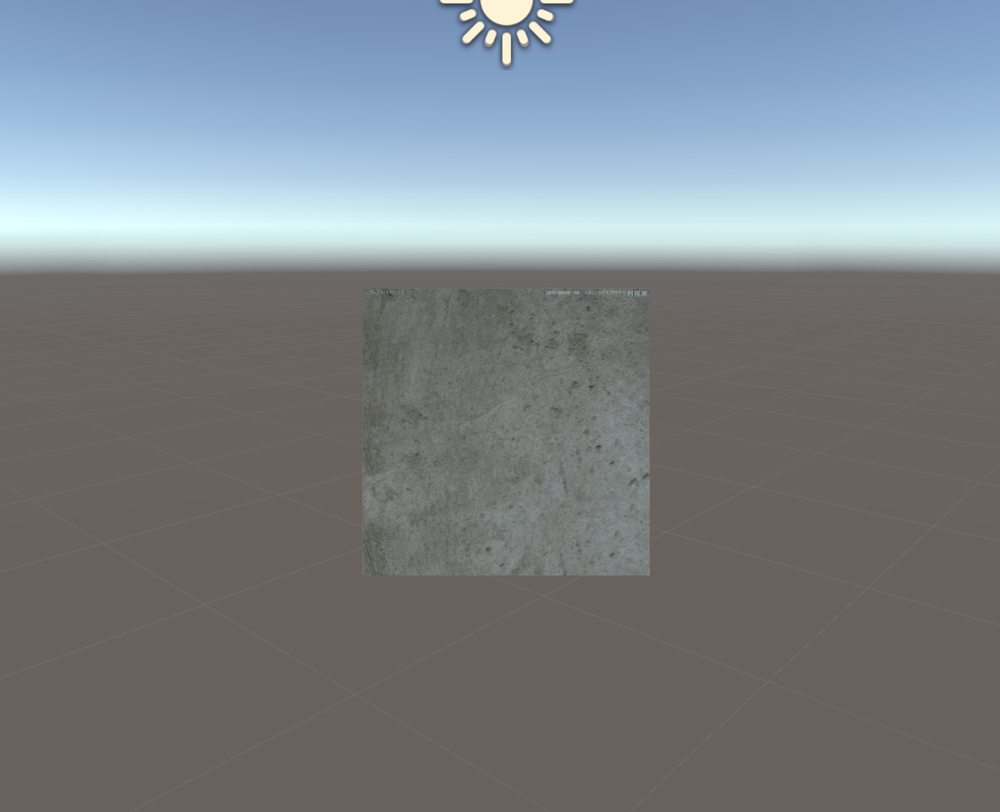

# 一、什么是 Mipmap

在三维计算机图形的贴图渲染中有一个常用的技术被称为Mipmapping。为了加快渲染速度和减少图像锯齿，贴图被处理成由一系列被预先计算和优化过的图片组成的文件,这样的贴图被称为 MIP map 或者 mipmap。这个技术在三维游戏中被非常广泛的使用。  Mipmap 需要占用一定的内存空间，同时也遵循小波压缩规则（wavelet compression）

Mipmap中每一个层级的小图都是主图的一个特定比例的缩小细节的复制品。虽然在某些必要的视角，主图仍然会被使用，来渲染完整的细节。但是当贴图被缩小或者只需要从远距离观看时，mipmap就会转换到适当的层级。事实上，在三线性过滤（trilinear filtering）起作用时，会在两个相近的层级之间切换。

因为mipmap贴图需要被读取的像素远少于普通贴图，所以渲染的速度得到了提升。而且操作的时间减少了，因为mipmap的图片已经是做过抗锯齿处理的，从而减少了实时渲染的负担。放大和缩小也因为mipmap而变得更有效率。

如果贴图的基本尺寸是256x256像素的话,它mipmap就会有8个层级。每个层级是上一层级的四分之一的大小，依次层级大小就是：128x128;64x64;32x32;16x16;8x8;4x4;2x2;1x1(一个像素)。例如在一个场景中，渲染贴图需要填满的空间大小是40x40像素的话，如果没有三线性过滤，那32x32 会被放大显示，或者有三线性过滤，会在64x64和32x32之间切换。最简单的生成贴图的方法就是依次做平均，当然也可以用更加高级的算法。

# 二、使用方式

勾选Fadeout Mip Maps就可以了

Fade Range 是调整摄像机距离的显示效果的，可以跟进实际项目需求调整

测试步骤

1：同样新建一个带有texture贴图参数的材质球

2：将设置好MipMap的texture赋值给材质球

3：将材质球赋值给我们的测试物体

 

# 三、对比

为了看的更直观，我先取消MipMap功能

=====================取消MipMap功能===============================

近距离：

远距离：

 

 除了看起来小一点，没什么区别

 

==========================勾选MipMap===================================

（为了看的更直观，我将参数设置的比较大，稍微拉小一点就会有变化）

近距离

 

 远距离

​			 										

 

很明显的图片纹理做了模糊处理，质感降低了，纹理也少了很多。从而降低显存的占用，提升渲染性能。

不过每一种优化方式本身就会产生额外的开销，MipMap也是

实用MipMap之后，texture的大小也会随之变大，和Lod同理，在使用了mipmap的同时Unity也会创建出低精度的texture，从而占用内存。

还是那样，具体的利弊，各位看项目的实际情况使用啦~