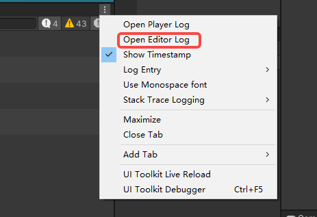
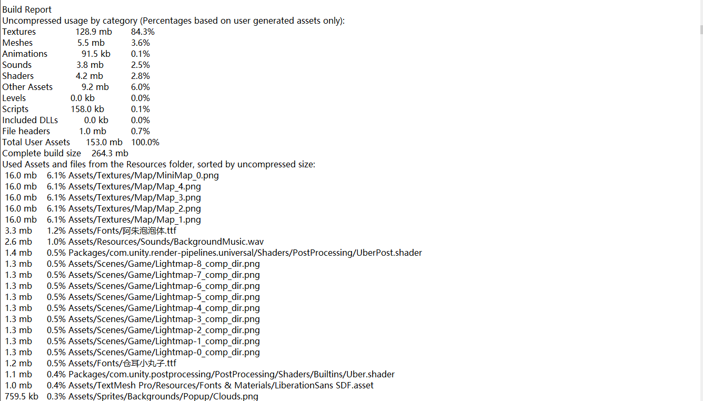

# 包体大小优化

## 一、文件占比

1. 成一次打包build

2. Console 窗口的右上角直接打开Editor Log。

   

3. 文件内容如下：

   

## 二、Unity打包规则

* 所有非editor下的托管代码会编译为dll，dll会进入包体。

* 所有StreamingAssets下的文件会被**复制**到包体。

* 所有Resource下的资源会被无条件打包。

* 所有加入到构建中的场景以及他们所引用的所有资源都会进入包体，如场景使用了模型，模型使用了材质，材质使用了shader和贴图，这些资源都被引用了。

* plugin下的本地库等会视情况打包
* Unity在build中不会打项目中完全没有引用的资源，所以对于确定不会使用和引用的资源，不用刻意的删除
* 所有的资源格式都是Unity自己的格式，所以资源原文件的类型对最终包体大小无关。例如使用一张PS纹理，在build前它会被拼接、压缩，就算把此纹理转为PNG或JPG等格式，最终对于减少包体大小没有帮助

## 三、优化方案

### 3.1 Unity设置

1. Striping Level 裁剪等级

   裁剪等级设置的越小，代码裁剪的越多，包体也就越小，但是会带来一些限制，所以酌情使用即可。具体可参考Unity文档。

2. .net subset .net子集

   .net中常用功能均在.net子集中，如果你只使用了这些功能，就可以选用.net子集，.net子集比.net2.0大约小1M-2M

3. script call optimization （iOS）

   根据文档，选择Fast but no exceptions会减少大小，但具体减少多少未测试，且选择这项从字面理解应该是出现异常应用会闪退。

4. 削减架构支持

   比如安卓如果只打算支持armv7设备，则不要选择x86或arm+x86，iOS同理（bit code待测试）

### 3.2 代码优化

1. 移除不必要的代码依赖

   如果你的代码中存在一些大型库的源码或dll，如json.net，但却并没有用到，应该将其移除，这些代码或dll可能占用比较大的空间（json.net的dll占用1M），如果经过il2cpp编译则可能更大。

2. 避免值类型作为泛型

### 3.3 资源优化

#### 3.3.1 Assets与StreamingAssets的区别

要理清资源优化的关键，先搞清Assets与StreamingAssets的区别

StreamingAssets下的文件，在打包时会直接复制进包里，只能通过IO或者WWW读取成Assets之后才能使用

Assets是一般的资源，比如拖拽在脚本上的引用的物体，图片，声音等，以及放在Resources下的文件。直接访问代码的引用或者Resources. Load使用。

可以看出来Assets和StreamingAssets的第一个区别就是StreamingAssets需要IO读取成Assets，而Assets好像Unity会在引用到时，或者Resources. Load时自动载到内存中

StreamingAssets打包时是直接复制的文件，jpg还是原来的jpg，png还是原来的png，文件一点也不会变，而Assets是经过Unity处理过的，处理成了3D引擎或者硬件可以直接使用的格式，比如图片在nvidia显卡中以dds或dxt格式使用。于是，可以理解StreamingAssets是磁盘上的资源，assets是内存中的资源，需要注意的是并非所有Assets都是内存格式打包的。

下面将StreamingAssets这类资源成为**流资源**，将Assets称为**内存资源**。

#### 3.3.2 图片

图片是游戏中使用最多的资源，使用方式繁多，因此将会花大篇幅介绍优化理论和技巧。

有了以上理论就可以解释Unity的Inspector图片预览中显示的大小和磁盘中文件的大小不一致了，预览窗口显示的是内存格式，所以格式和大小都不一样。

**图片资源在Unity中以内存资源打包**，空间占用大小只和尺寸和格式有关，所以你在外部无论如何压缩图片质量，图片大小，只要不改变内存大小和内存格式，那么打包大小始终不变。

* 图片内存尺寸

  通常为了GPU性能3D贴图资源最好使用2的n次幂，普通2D资源为了使用方便可以没有这个要求，图片尺寸优化只需要在质量可以接受情况下使用越小的越好，直接在Unity中调节max size即可。

* 图片内存格式

  显卡能使用的只能是内存格式，Unity中的内存格式分为了3类，compressed、16bit、TrueColor。

  关于Alpha通道，Alpha通道是图片通道中的一个，通常表示透明，但并不一定表示透明，如果一张图片有Alpha通道，或者有透明像素，那么这张图片就带有Alpha通道。

1. TrueColor

   TrueColor,真彩色，颜色值最多，质量最好，大小最大，一般只用在追求美术质量的2D图片上。

> - RGB24bit 不带A通道的图片格式
> - Alpha8bit 只带有Alpha通道信息
> - RGBA32bit 同时带有RGBA通道
> - ARGB32bit 同时带有RGBA通道，与RGBA不同处不详

     带有通道信息越少的格式，自然同样尺寸下，大小更小，所以如果一张图片没有透明或者不需要alpha通道，则不要保留alpha通道或透明像素，对于没有alpha的图片，Unity会自动选择没有alpha的格式，能够节约1/4的大小。

2. 16bit

   16bit,只包含16位色，因为颜色较少，一些渐变会出现过度不均匀，质量较差，大小比TrueColor小。一般用于16位色质量可接受的图片上，或者需要alpha通道的3D贴图上。

   16bit格式包含rgb16bit,rgba16bit,argb16bit,所包含的通道按照以上名字规律，**需要注意的是格式大小只和bit数有关**，也就是说rgb16bit,argb16bit虽然通道不一样，但都是16bit，所以大小一样，但argb16bit颜色更少，质量也越差，所以在重复一遍，不需要透明就不要保留alpha，透明不仅带来空间增大，质量也会变差。

3. Compressed

   压缩格式，根据显卡需要的格式进行压缩，如iOS设备使用PowerVR处理器，则适合的贴图格式是PVRTC等，Android手机根据芯片不同有ETC，ATC，DXT，PVRTC等，但一般不会根据具体的手机打不同的包，所以一般选择ETC，**需要注意最好不要手动选择压缩格式**，应该选择auto Compress，Unity会自动选择最适合该平台的格式。如果选错格式，那么在运行时会对贴图进行转码，大大拉大加载时间。

   压缩格式的图片大小，取决于不同的格式，但一般都会比TrueColor或16bit小很多，质量一般还行，因此是3D贴图的首选，大部分压缩格式要求为2的n次幂，且大部分压缩格式不支持alpha或者支持alpha但效果不好。部分2D图片使用起来会稍微麻烦，比如强制为2的n次幂时sprite不能用。

4. Mipmap

   有关mipmap的详细介绍可以参考`https://en.wikipedia.org/wiki/Mipmap`，简单的说mipmap是为了优化3D中的显存占用和显示效果的，开启这项图片增大33%，且相机距离较远时图片会变糊，因此，2D图片不能开启这项，3D中一般的贴图需要开启，其他酌情考虑。

5. 图片优化总结

   - 不留不必要的A通道，不留不必要的A通道，不留不必要的A通道

   - 其实Unity已经做得足够智能了，一般你只需要选择贴图类型如texture,还是sprite,还是lightmap，他就能自动处理好大多数了。

   - 2D图片，移除mipmap，质量要求高的选用TrueColor,要求低的选用16bit或compressed

   - 3D贴图，酌情关闭mipmap,优先选用compressed，谨慎使用TrueColor。

   - 合理选择图片大小。

6. 高级优化

* 16bit的优化

  使用16bit时，会出现明显的颜色过度不均匀，可以通过RGBA4444和dithering优化显示效果

* 利用StreamingAssets的优化

  一张1024x1024 RGB24的图片内存资源大小为3MB，而一张1024 x 1024的JPG图片如果优化得当仅几百K，可以将JPG图片放在StreamingAssets下，让后运行时读取，这么做确实能够在保证质量的条件下节省很多大小，但加载十分慢，需谨慎使用。

* 分离Alpha通道优化

  压缩格式能够做到高质量小空间，但压缩格式一般对Alpha的支持较差，也就是说如果一张ARGB的图可以去掉A通道，就可以使用压缩格式来优化大小。

  可以通过将Alpha通道提取出来作为另外一张图的R通道，那么我们将得到两张没有Alpha通道的图，且代表Alpha通道的图可以缩小尺寸，两张没有A通道的图一般可以比一张带A通道的图小，所以这个优化从原理上可行，也有很多游戏这么做，但是需要额外处理shader，且渲染时需要解析两张图等，综合考虑目前我们没有采用这种方式。

#### 3.3.3 声音

声音资源在Unity打包时以流资源存在，也就是说文件大小会影响打包大小，Unity预览窗口中显示的大小是内存占用。在Unity中调节声音文件参数不会影响打包大小。

影响声音文件大小的因素 **待补充**

#### 3.3.4 模型

选择模型导入中的mesh compression 可以减少模型占用包体大小，但会出现一些变形和UV精度丢失等，调节压缩到可接受的等级即可，如果是UV精度丢失（常见任务对称中心出现一条缝）可以将贴图画出UV线更多。

#### 3.3.5 动作

选择动画导入中的Anim.Compression可以减少动画占用包体大小，同样可能出现动画变形等，调节到合适参数即可，一般选择keyframe reduction。

#### 3.3.6 场景

1. Static Batch大小优化

   场景本身在包体大小上并没有太多可以优化，但需要注意如果你的场景大量使用Static Batch，你会发现勾选Static Batch的场景打包后比不勾选Static Batch要大，估计Unity在打包时把Static Batch的网格合并成了一个，比如你有一棵树，这棵树本身只占一个模型大小，这棵树在场景中复制很多份仍然只占一个模型大小，但如果这些树勾选static batch，那么打包时会合并为一个树林，原来的树模型就不需要了，而是变为了一个大树林模型，大小自然变大了

   解决办法：取消场景的Static Batch，取消后DrawCall无法合并，通过调用`StaticBatchingUtility.Combine`进行批处理即可达到原来的效果。这个做法可能会导致场景加载时间变长，但一般感觉不出来（待测试）。

2. [BuildReport插件](https://www.assetstore.unity3d.com/cn/#!/content/8162)

   Unity每次打包后会生成一个文件记录哪些资源被打包了，BuildReport可以解析这个文件让你非常方便的查看哪些资源占用空间多，针对性的处理。