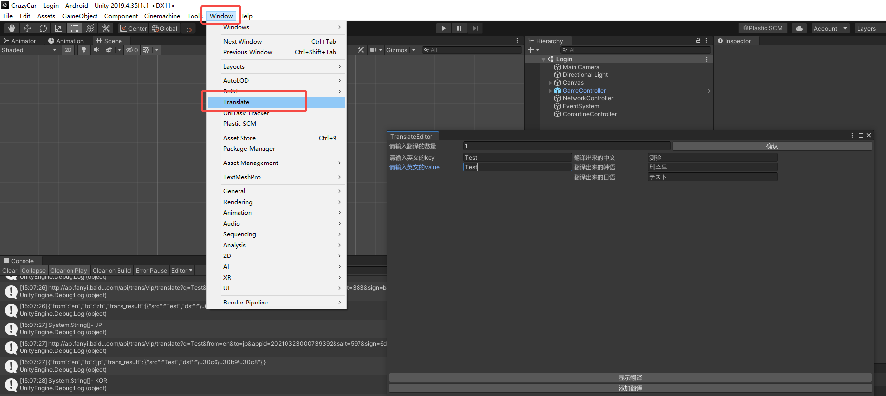
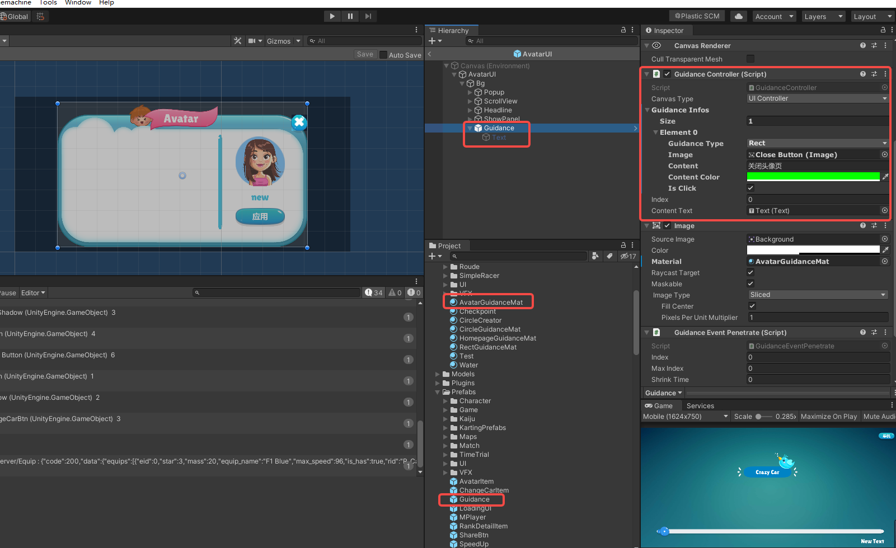
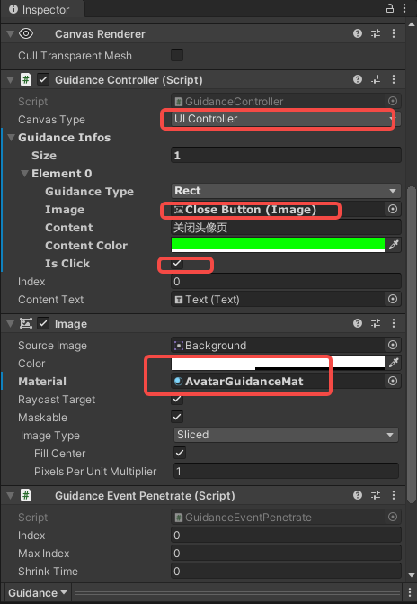

# CrazyCar
unity 制作前端游戏；Java+MySQL+Tomcat+Nginx部署服务器

## 运行

1. 用**Unity**(2019.4.35及以上)打开**CrazyCar -> CrazyCar**项目；
2. 在**Unity**中设置**Login**场景中的**NetworkController**，设置成**Local**(当然你不愿意部署服务器，也可以使用**Remote**，那就可以跳过下面所有的步骤)；
3. 搭建服务器环境 **下文提供简单参考**
4. 启动**Mysql**，并运行**CrazyCar -> CrazyCarDB**中的**CrazyCar.sql**脚本，部署数据库
5. 用**Eclipse**打开**CrazyCar -> CrazyCarServer**项目，如果是首次打开，**Maven**需要自动下载依赖包(**右键项目->Maven->Update Maven**)，这个可能需要点时间，**Eclipse4.21.0**已经自带**Maven**环境所以等着就行；
6. 更新完Maven后，**Project->Clean**，然后**Project->BuildAll**(注意关闭**Project->Automatic**)
7. 运行**Eclipse**，如果是首次运行，系统会提示你添加**Tomcat**，添加即可；(如果你只是本地测试，不需要再启动**Nginx**)
8. 后台运行成功后，即可运行**Unity**客户端；

> 1. 如果你是第一次部署服务器，可能会出现Mysql运行脚本、Eclipse添加Tomcat、Maven环境加载失败等问题，请自行百度！
> 2. 游戏支持单机模式，如果你没有服务器，也可以进行打版测试(直接Build出版本就行)

## 环境版本

1. Unity 2019.4.35
2. VS 2019
3. Eclipse 4.21.0
4. JDK 1.8.0_91
5. JRE 1.8.0_91
6. MySQL 8.0.26
7. Tomcat 8.0.52
8. Nginx  1.20.1

## 环境配置

* 服务器配置流程（windows）

  ```mermaid
  graph LR
  start-->购买服务器-->配置Java环境-->配置Web服务器(Tomcat)-->配置Mysql
  ```

  

* 客户端配置流程（Windows/Mac）

  ```mermaid
  graph LR
  start-->配置Java环境-->配置Web服务器(Tomcat)-->配置Mysql-->安装Unity-->安装Eclipsep_使用VScode也可以
  ```

  

### 一、配置服务器基本属性

1. 购买云服务器 [华为云](https://www.huaweicloud.com/?locale=zh-cn)
2. 设置云服务的安全组[入口](https://console.huaweicloud.com/lcs/?agencyId=0d551b5ba600f5841fd4c0182c6aa4b6&region=cn-south-1&locale=zh-cn#/lcs/manager/vmList/vmDetail/securitygroups?instanceId=410b1a5b-ee07-434a-8fea-c2c6e3b54a7d) ，华为云初始化会有三个安全组，其中有一个Web Server组是用来做Web开发的，它已经把80、443等网络端口开放，当然也可以自己去设定比如开放8080

### 二、配置Java环境

1. 下载JDK[安装](https://www.jdkdownload.com/) ，注意不是JRE，JDK中包含JRE
2. 配置Java的环境变量
3. 在CMD输入JVAV进行测试配置是否成功

### 三、配置Web服务器

1. 下载并安装[Tomcat](https://www.jdkdownload.com/)
2. 启动Tomcat
3. 浏览器输入localhost:8080，进行测试安装是否成功
4. 下载[Nginx](http://nginx.org/en/download.html)
5. 启动Nginx
6. 浏览器输入localhost:80，进行测试安装是否成功
7. 配置Nginx，将80端口映射成8080
8. 此时就可以直接通过访问IP地址，实现对8080端口的Tomcat下的Web项目

### 四、安装Eclipse Java EE

1. 官网已经停止此安装包，只能通过三方下载
2. 创建Servlet Web项目进行测试，注意此时的Eclipse可能只支持Tomcat8.0，不支持8.5，两个版本差别只在于，8.0多了一个图像界面
3. 服务器本地测试运行正常后，将项目打包成WAR包，复制到Tomcat的webapps文件夹下
4. 重启Tomcat后，Tomcat会自动解压文件夹
5. 此时应该可以从本地访问服务器，通过类似于http://IP/TestServlet/TestServlet的地址访问服务器

### 五、安装MySQL

1. 下载并安装[MySQL](https://dev.mysql.com/downloads/mysql/)
2. 根据下载的版本，下载相关[JDBC](https://mvnrepository.com/artifact/mysql/mysql-connector-java) （账户：root ；密码：1647283556；此账户密码应该与**CrazyCar\CrazyCarServer\src\main\java\Util\Util.java** 中的一致）
3. 将下载好的JAR包复制到Tomcat下的Lib文件夹
4. 根据测试项目进行连接测试，[菜鸟教程](https://www.runoob.com/java/java-mysql-connect.html)

## 游戏引擎

**Unity 2019.4.35 及以上**

## 添加新的热更类型

*以添加新类型Medal(勋章)为例*

1. **CrazyCar\CrazyCar\Assets\AB**文件夹下添加新的文件夹**Medal**
2. 相应的资源放入此文件夹
3. 打开**Windows -> Asset Management -> Groups**窗口
4. 点击**Create**创建新的**Group**，命名为**Medal**
5. 将资源拖入此分组
6. 点击**Build -> Update a previous Build**，进行生成增量包  (请自行百度**Addressable**了解生成新包和增量包的区别)
7. 将**CrazyCar\CrazyCar\ServerData**下生成的包放入**CrazyCar\CrazyCarServer\src\main\webapp**重新生成**War**包发布到服务端即可

## 添加头像

1. 将头像放入**Assets -> AB -> Avatar** 文件夹
2. 将新头像拖入**Windows -> Asset Management -> Groups**窗口，中的**Avatar**分组
3. 在数据库**avatar_name**表中添加新的头像信息，ID字段为头像名
4. 运行Unity，进行查看
5. 点击**Build -> Update a previous Build**，进行生成增量包 
6. 将**CrazyCar\CrazyCar\ServerData**下生成的包放入**CrazyCar\CrazyCarServer\src\main\webapp**重新生成**War**包发布到服务端即可

## 自动化打版

1. 安卓和PC都是直接点击**Window--> Build -->Local**，进行打版。(过程中会让你选择目标文件夹)

2. IOS选择文件时，要确保文件夹下有**CrazyCarXCode**文件夹，即选中的文件夹下需要有**CrazyCarXCode**子文件夹

   ```c#
    BuildPipeline.BuildPlayer(EditorBuildSettings.scenes, Path.Combine(path, "CrazyCarXCode"), BuildTarget.iOS, BuildOptions.AcceptExternalModificationsToPlayer);
   ```

3. 如果没有服务器，游戏支持单机模式，但是只能使用主功能，直接使用**File --> BuildSettings --> Build**即可

3. 当然也可以直接去File -> Build ，使用系统打板。

## 添加装备

1. 复制一个**CrazyCar --> CrazyCar --> Assets --> AB --> Equip--> Items**文件夹下个任意一个**Prefab** ，并重命名
2. 将你的装备的**Icon**、**Material**、**Mesh**放入**CrazyCar --> CrazyCar --> Assets --> AB --> Equip**对应的文件夹
3. 双击开你的**Prefab**修改**Prefab**对应的信息，在复制好的基础上进行处理你要添加你的装备(当然你也可以重新制作一个新的，最后将EquipResource脚本放在根节点，并填好信息即可)
4. 将新装备**prefab**拖入**Windows -> Asset Management -> Groups**窗口，中的**Equip**分组
5. 在数据库**all_equip**表中添加装备信息
6. 运行Unity，进行查看
7. 点击**Build -> Update a previous Build**，进行生成增量包 
8. 将**CrazyCar\CrazyCar\ServerData**下生成的包放入**CrazyCar\CrazyCarServer\src\main\webapp**重新生成**War**包发布到服务端即可

## 增加TimeTrial关卡

1. 在数据库**time_trial_class**表中添加关卡信息即可

   > map_id为0-4，因为现在就5张图

## 增加比赛

1. 在数据库**match_class**表中添加关卡信息即可

> map_id为0-4，因为现在就5张图

## 添加地图

1. 在**Unity**中打开**MapController.prefab**，添加你的地图

2. 将新图拖入到**MapController**中的**MapsGO**中

3. 从**Map0**中复制一份**CheckpointController**，到新地图，并将**CheckpointController**里面的**Checkpoint**和**EndSign**，移动到相应的位置

4. 从**Map0**中复制一份**MiniMap**，到新地图，将**MiniMap**下**Plane**中的**Material**换成新地图的素材

5. 打开**Game**场景，将新地图的**Scale**调整的和现有地图大小相似

6. 地图的起点位置为，**Game**场景中**StartPos**所在的位置

7. 添加路线

   * 添加Path空物体

   * 在Path空物体下添加空物体PathCreator

   * 给PathCreator添加PathCreator组件

   * 通过Shift+左鼠标键添加节点，Ctrl+左鼠标键删除节点，制作地图路线 

     > 详情操作可以查看[Path Creator - Google 文档](https://docs.google.com/document/d/1-FInNfD2GC-fVXO6KyeTSp9OSKst5AzLxDaBRb69b-Y/edit#heading=h.gnp37l55xf4w)

8. 可以在**TimeTrial**添加相应的关卡进行测试

## 添加多语言

1. 打开**Tools --> Translate**窗口

   

2. 输入要翻译的文案数量以及内容，点击**显示翻译**按钮

3. 查看翻译内容是否合适

4. 点击添加**翻译按钮**，文案就会自动添加到**CrazyCar\CrazyCar\Assets\Resources\Language\Locales**对应的文件里

## 添加新手教程

1. 在需要添加新手教程的页面添加**Guidance**预制体

   

2. 设置**Guidance**参数

    

   * **CanvasType**
     **Guidance**组件需要提供UI所在的父物体**Canvas**组件，在**Index**场景是通过**UIController**脚本管理所以页面，如果新增页面，有新的Canvas，需要在**GuidanceSystem**脚本进行添加并赋值，可以参考**UIController**操作过程

   * **GuidanceType**

     可以设置点击区域是圆形还是矩形

   * **IsClick**

     区域是否需要点击功能，如**AvatarUI**的这个关闭按钮不需要实现关闭**AvatarUI**页面功能，则不勾选
     
   * 每个**Guidance**都需要新建一个**Material**(复制一份现有的**AvatarGuidanceMat**重命名就可以)
   
   *注：完成标识符为**UserModel**中的**IsCompleteGuidance**，完成条件为点击**计时赛按钮***
