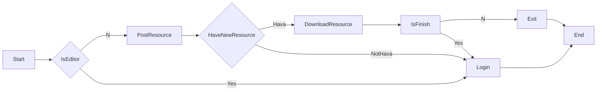

# CrazyCar
unity 制作前端游戏；Java+MySQL+Tomcat+Nginx部署服务器

## 运行

1. 用**Unity**(2019.4.35及以上)打开**CrazyCar -> CrazyCar**项目；
2. 在**Unity**中设置**Login**场景中的**NetworkController**，设置成**Local**(当然你不愿意部署服务器，也可以使用**Remote**，那就可以跳过下面所有的步骤)；
3. 搭建服务器环境 **下文提供简单参考**
4. 启动**Mysql**，并运行**CrazyCar -> CrazyCarDB**中的**CrazyCar.sql**脚本，部署数据库
5. 用**Eclipse**打开**CrazyCar -> CrazyCarServer**项目，如果是首次打开，**Maven**需要自动下载依赖包(**右键项目->Maven->Update Maven**)，这个可能需要点时间，**Eclipse4.21.0**已经自带**Maven**环境所以等着就行；
6. 更新完Maven后，**Project->Clean**，然后**Project->BuildAll**(注意关闭**Project->Automatic**)
7. 运行**Eclipse**，如果是首次运行，系统会提示你添加**Tomcat**，添加即可；(如果你只是本地测试，不需要再启动**Nginx**)
8. 后台运行成功后，即可运行**Unity**客户端；

> 1. 如果你是第一次部署服务器，可能会出现Mysql运行脚本、Eclipse添加Tomcat、Maven环境加载失败等问题，请自行百度！
> 2. 游戏支持单机模式，如果你没有服务器，也可以进行打版测试(直接Build出版本就行)

## 环境版本

1. Unity 2019.4.35
2. VS 2019
3. Eclipse 4.21.0
4. JDK 1.8.0_91
5. JRE 1.8.0_91
6. MySQL 8.0.26
7. Tomcat 8.0.52
8. Nginx  1.20.1

## 服务器环境配置

### 一、配置服务器基本属性

1. 购买云服务器 [华为云](https://www.huaweicloud.com/?locale=zh-cn)
2. 设置云服务的安全组[入口](https://console.huaweicloud.com/lcs/?agencyId=0d551b5ba600f5841fd4c0182c6aa4b6&region=cn-south-1&locale=zh-cn#/lcs/manager/vmList/vmDetail/securitygroups?instanceId=410b1a5b-ee07-434a-8fea-c2c6e3b54a7d) ，华为云初始化会有三个安全组，其中有一个Web Server组是用来做Web开发的，它已经把80、443等网络端口开放，当然也可以自己去设定比如开放8080

### 二、配置Java环境

1. 下载JDK[安装](https://www.jdkdownload.com/) ，注意不是JRE，JDK中包含JRE
2. 配置Java的环境变量
3. 在CMD输入JVAV进行测试配置是否成功

### 三、配置Web服务器

1. 下载并安装[Tomcat](https://www.jdkdownload.com/)
2. 启动Tomcat
3. 浏览器输入localhost:8080，进行测试安装是否成功
4. 下载[Nginx](http://nginx.org/en/download.html)
5. 启动Nginx
6. 浏览器输入localhost:80，进行测试安装是否成功
7. 配置Nginx，将80端口映射成8080
8. 此时就可以直接通过访问IP地址，实现对8080端口的Tomcat下的Web项目

### 四、安装Eclipse Java EE

1. 官网已经停止此安装包，只能通过三方下载
2. 创建Servlet Web项目进行测试，注意此时的Eclipse可能只支持Tomcat8.0，不支持8.5，两个版本差别只在于，8.0多了一个图像界面
3. 服务器本地测试运行正常后，将项目打包成WAR包，复制到Tomcat的webapps文件夹下
4. 重启Tomcat后，Tomcat会自动解压文件夹
5. 此时应该可以从本地访问服务器，通过类似于http://IP/TestServlet/TestServlet的地址访问服务器

### 五、安装MySQL

1. 下载并安装[MySQL](https://dev.mysql.com/downloads/mysql/)
2. 根据下载的版本，下载相关[JDBC](https://mvnrepository.com/artifact/mysql/mysql-connector-java)
3. 将下载好的JAR包，一份复制到Eclipse中的Web项目下，并导入项目中；一份复制到Tomcat下的Lib文件夹
4. 根据测试项目进行连接测试，[菜鸟教程](https://www.runoob.com/java/java-mysql-connect.html)

## 游戏引擎

**Unity 2019.4.35 及以上**

## 添加新的热更类型

一、热更流程图



二、以添加新类型Medal(勋章)为例

1. **CrazyCar\CrazyCar\Assets\AB**文件夹下添加新的文件夹**Medal**
2. 在**Inspection**窗口设置**Medal**文件夹的**Asset Labels**为**medal**
3. 将热更资源移动到此文件夹
4. 在**CrazyCar\CrazyCarDB\CrazyCar.sql**数据库的**ab_resource**表中添加相应的资源信息*(Hash现在可以随便填写，等客户端打出AB包后使用相应地信息)*
5. 在**Resource.java**中添加相应的字段
6. 在**ResourceSystem.cs**中添加相应的**ABType**，**CheckCoroutine()**，**InitABInfo()**代码
7. **CrazyCar\CrazyCar\Assets\StreamingAssets\config.json**中添加相应的**key**
8. 在**BuildHelper.cs**的**FetchResource()**添加相应的代码*(用来一键打AB包)*
9. 点击**Window--> Build --> AB --> Local**进行AB打包*(需要在本地部署好服务器)*

> 注意：每次打包操作都会在打完后自动拉取后台资源接口，更新本地的config.json文件里的内容，这样每次出版本时就不需要将本地的资源包同步到后台，这就意味着后台的资源包会落后客户端的；在需要中途热更资源时再通过客户端打包，并将**Console**窗口中的相应资源的**CRC**和**Hash**以及**CrazyCar\CrazyCar\Assets\StreamingAssets**里相应的AB包发送给后台进行配置即可

## 添加头像

一、热更新

1. 点击**Unity**中的**Window--> Build --> AB --> Local** ，生成AB包
2. 记录**Unity**中的**Console**窗口会打印出类似**avatar Hash is:  b99e280df02593fde9ce4e342f4ea477 CRC: 2776471209**的Log，记录好
3. 更新数据库**ab_resource**表中的对应平台的**Hash**以及**CRC**
4. 将**CrazyCar\CrazyCar\Assets\StreamingAssets**中的**avatar_pc**(如果你是测试的是PC平台)，复制到**CrazyCar\CrazyCarServer\src\main\webapp**
5. 在数据库**avatar_name**表中添加新的头像信息，ID字段为头像名
6. **Unity**的**Edit**模式下不会拉取后台的资源包，会直接加载本地的文件，可以打一个PC的AB包进行本地测试热更新，或者修改**ResourceSystem.cs**文件中的**CheckNewResource()**以达到在**Edit**模式下测试完整的热更新功能，但是在打版本之前需要修改**CrazyCar\CrazyCar\Assets\StreamingAssets\config.json**中的**Hesh**，随意修改一下即可
7. 然后就通过打出来的版本，进行测试热更新

> AB包实现热更新的原理：
>
> 1. 用户登录客户端
> 2. 拉取后台接口，获取最新资源包的**Hash**和**CRC**
> 3. 对比**CrazyCar\CrazyCar\Assets\StreamingAssets\config.json**中的**Hesh**和**CRC**，不相同就拉取后台的AB资源包
>
> 所以打版本的时候会**先**拉取后台的**Hesh**和**CRC**，并记录到**config.json**文件中，这样就不用每次打出新资源都同步到后台，这样就表现为虽然后台的资源是旧的但是**Hesh**和**CRC**都是最新的，就不会更新资源。

二、非热更新

1. 在**CrazyCar --> CrazyCar --> Assets --> AB --> Avatar** 文件夹添加你要添加的头像，头像名按照既有的依次叠加即可，此为ID
2. 在数据库**avatar_name**表中添加新的头像信息，ID字段为头像名
3. **Unity**的**Edit**模式下直接运行即可测试

> 本地搭建服务器，进行测试热更新只能将Unity平台切换到PC才行；Unity的AB包每个平台都是不同的，所以如果你使用的是云服务器，就需要按你要测试的平台进行测试，如你要测试安卓，就需要切换到安卓打包

## 自动化打版

1. 安卓和PC都是直接点击**Window--> Build -->Local**，脚本会先打AB包，然后拉取后台AB的信息，防止热更新，最后进行打版。(过程中会让你选择目标文件夹)

2. IOS选择文件时，要确保文件夹下有**CrazyCarXCode**文件夹

   ```c#
    BuildPipeline.BuildPlayer(EditorBuildSettings.scenes, Path.Combine(path, "CrazyCarXCode"), BuildTarget.iOS, BuildOptions.AcceptExternalModificationsToPlayer);
   ```

3. 如果没有服务器，游戏支持单机模式，但是只能使用主功能，直接使用**File --> BuildSettings --> Build**即可

## 添加装备

1. 复制一个**CrazyCar --> CrazyCar --> Assets --> AB --> Equip--> Items**文件夹下个任意一个**Prefab** ，并重命名
3. 将你的装备的**Icon**、**Material**、**Mesh**放入**CrazyCar --> CrazyCar --> Assets --> AB --> Equip**对应的文件夹
4. 双击开你的**Prefab**修改**Prefab**对应的信息，在复制好的基础上进行处理你要添加你的装备
5. 在数据库**all_equip**表中添加装备信息
6. 运行Unity，进行查看

## 增加TimeTrial关卡

1. 在数据库**time_trial_class**表中添加关卡信息即可

   > map_id为0-4，因为现在就5张图

## 增加比赛

1. 在数据库**match_class**表中添加关卡信息即可

> map_id为0-4，因为现在就5张图

## 添加地图

1. 在**Unity**中打开**MapController.prefab**，添加你的地图
2. 将新图拖入到**MapController**中的**MapsGO**中
3. 从**Map0**中复制一份**CheckpointController**，到新地图，并将**CheckpointController**里面的**Checkpoint**和**EndSign**，移动到相应的位置
4. 从**Map0**中复制一份**MiniMap**，到新地图，将**MiniMap**下**Plane**中的**Material**换成新地图的素材
5. 打开**Game**场景，将新地图的**Scale**调整的和现有地图大小相似
6. 地图的起点位置为，**Game**场景中**StartPos**所在的位置
7. 可以在**TimeTrial**添加相应的关卡进行测试

## 添加多语言

1. 打开**Tools --> Translate**窗口
2. 输入要翻译的文案数量以及内容，点击**显示翻译**按钮
3. 查看翻译内容是否合适
4. 点击添加**翻译按钮**，文案就会自动添加到**CrazyCar\CrazyCar\Assets\Resources\Language\Locales**对应的文件里
