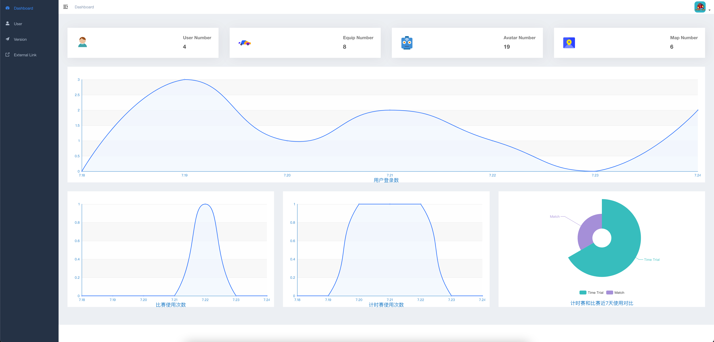
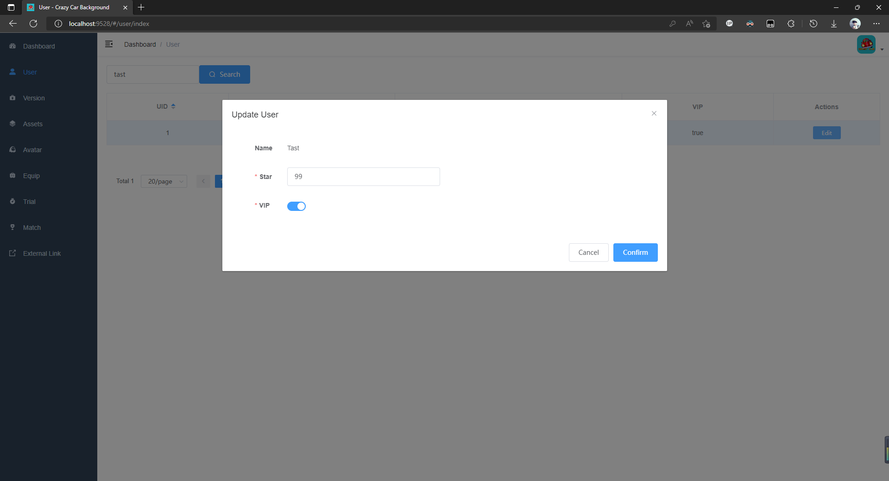
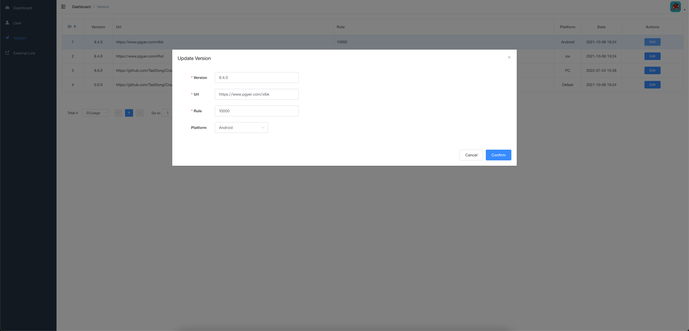

  <h2 href="https://github.com/TastSong/CrazyCar">
    
  </h2>
  <h2 align="center">
    Network online game solutions
  </h2>  
    
    
    
    
    

English  | &nbsp;[中文](./README.md)

------

## overview

**Crazy Car** is an online racing game, its overall structure is：[QFramework](https://github.com/liangxiegame/QFramework) & [Addressable](https://github.com/Unity-Technologies/Addressables-Sample)(Game) + [Spring Boot](https://github.com/spring-projects/spring-boot) & [Mybatis](https://github.com/mybatis/mybatis-3)(Server) + [KCP](https://github.com/l42111996/java-Kcp) / [WebSocket](https://github.com/psygames/UnityWebSocket) (Network)  + [Vue & Element](https://github.com/PanJiaChen/vue-element-admin)(Background) ,with this architecture, developers can complete a customized online game with only a few modifications.

The main demonstration functions are: login registration, hot change picture and equipment, time trial, two-person competition, version control (Background), user information management (Background) and other functions.

    
    
    

Download：[Android](https://www.pgyer.com/xlbk)、[IOS](https://www.pgyer.com/rRut)  (Due to the certificate issue, if you want to experience ios, you need to contact the author separately)  

ID：*(VIP ID：**Tast**；Password：**111111** )*

[Quick Start](./README_QuickStart.md)&nbsp;  | &nbsp;[Technical Documentation](./README_Dev.md)&nbsp;| &nbsp;[Update Log](https://github.com/TastSong/CrazyCar/releases)&nbsp; | &nbsp;[Design Document](./Document)&nbsp;

:clap:  Welcome **Crazy Car** ！ 

:loudspeaker: **Crazy Car ** during the development phase, the online database is reset irregularly;The Mater branch is not a release branch and it is recommended to use the [latest Releases](https://github.com/TastSong/CrazyCar/releases/latest) version for local testing 

## Features :point_down:

### Finish

:pushpin:Mandatory version update is supported

:satellite: The network synchronization mode is Networked physics

:telephone:Supports KCP and WebSocket 

:foggy:Using the URP Render Pipeline

:blue_book:The resource hot update method is Addressable

:video_game:Adopt Unity's new version of Input System, support a variety of controllers

:alien:Robot,Robots can compete with players in Time trial

:sunrise: Support avatar and equipment resource hot update

:rocket: On the login page, you can switch the single-machine mode with one click

:car: You can buy and wear avatars and racing cars

 :iphone:You can use this client on **Windows**、 **Android** and** IOS** devices

:earth_asia: Support for multiple languag,Multiple languages can be created in one click with **translateeditor. cs**

:page_facing_up: Personal information page, record personal achievements

:gemini:Time trial and multiplayer competition two modes

:baby:[Tutorial function](./README_QuickStart.md), provide visual configuration tutorial scheme

:roller_coaster: Route planning function, custom route

### TODO 

 - [ ] Optimize the callback logic using UniTask
 - [ ] Optimized robot logic
 - [ ] The car joins the suspension
 - [ ] Optimized race interface, added speed dashboard, etc
 - [ ] Timeline is introduced to realize the dialogue system
 - [ ] Background: Equipment and profile picture resource configuration
 - [ ] Use mesh crushing to achieve rollover effect效果
 - [ ] Hot fix: Lua
 - [ ] Optimize water entering effect
 - [ ] Buy VIP

## Connection
:email: ： TastSong@163.com

## Sample screenshots

  
    
    
    
    
    
    
    
    
    
    
    
    

 

## contribution
You can submit questions in the  [pull requests](https://github.com/TastSong/CrazyCar/pulls) or [issues](https://github.com/TastSong/CrazyCar/issues) format.

:seedling: Of course **Crazy Car** is still young and has many shortcomings, but please believe that it will keep moving forward   :running:

## Project Optimization

### Overview of optimization solutions

[Detailed document address](./ProjectOptimization/ProjectOptimization.md)

### Completed optimizations

1. [Dynamic batching、Staticbatching、Manualbatching、GPU Instancing、SRP Batcher](./ProjectOptimization/Blending.md)
2. [LOD](./ProjectOptimization/LOD.md)
3. [Mipmap](./ProjectOptimization/Mipmap.md)
3. [Package](./ProjectOptimization/Package.md)
3. [Network synchronization algorithm](./ProjectOptimization/NetworkSync.md)

## Reference

1. [UnityWebSocket: The Best Unity WebSocket Plugin for All Platforms. ](https://github.com/psygames/UnityWebSocket)
2. [QFramework: Unity3D System Design Architecture ](https://github.com/liangxiegame/QFramework)
3. [java-Kcp: 基于java的netty实现的可靠udp网络库(kcp算法)，包含fec实现，可用于游戏，视频，加速等业务 ](https://github.com/l42111996/java-Kcp)
4. [kcp4sharp: kcp for c#. ](https://github.com/beykery/kcp4sharp)
5. [DOTween (HOTween v2) Unity Asset Store](https://assetstore.unity.com/packages/tools/animation/dotween-hotween-v2-27676)
6. [Unity实现简化版卡丁车漂移](https://zhuanlan.zhihu.com/p/95013367)
6. [UIEffect: UIEffect is an effect component for uGUI element in Unity](https://github.com/mob-sakai/UIEffect)
8. [UnityNativeShare: A Unity plugin to natively share files ](https://github.com/yasirkula/UnityNativeShare)
8. [Path-Creator: Path creation asset for Unity game development ](https://github.com/SebLague/Path-Creator)
10. [AudioKit：Audio control plug-in](https://github.com/liangxiegame/AudioKit)
10. [Same Material - Static Mesh Combiner：Mesh Merge ](https://assetstore.unity.com/packages/tools/modeling/same-material-static-mesh-combiner-139565)
10. [AutoLOD ：Automatically generate lower Mesh and generate LOD](https://assetstore.unity.com/packages/tools/utilities/autolod-185662?locale=zh-CN)
10. [UniTask: Provides an efficient allocation free async/await integration for Unity.](https://github.com/Cysharp/UniTask)
10. [全部免费字体大全 (chaziti.cn)](https://chaziti.cn/free/)
10. [Transparent Culling System (URP) Occlusion elimination plug-in ](https://assetstore.unity.com/packages/tools/camera/transparent-culling-system-urp-212951)
10. [Simple Spin Blur](https://assetstore.unity.com/packages/tools/integration/simple-spin-blur-202273)
10. [LearnUnityShader: 记录学习Unity Shader过程中实现过的一些Demo)](https://github.com/csdjk/LearnUnityShader)
18. [Simple Water Shader URP](https://assetstore.unity.com/packages/2d/textures-materials/water/simple-water-shader-urp-191449)
18. [Metaverse Full-Body Online 3D Avatar Creator | Ready Player Me](https://readyplayer.me/)
18. [spring-boot: Spring Boot](https://github.com/spring-projects/spring-boot)
21. [Vue.js is a progressive, incrementally-adoptable JavaScript framework for building UI on the web.](https://github.com/vuejs/vue)
22. [element: A Vue.js 2.0 UI Toolkit for Web](https://github.com/ElemeFE/element)
23. [vue-element-admin: A magical vue admin](https://github.com/PanJiaChen/vue-element-admin)

## License
[MIT](https://github.com/TastSong/CrazyCar/blob/master/LICENSE)

