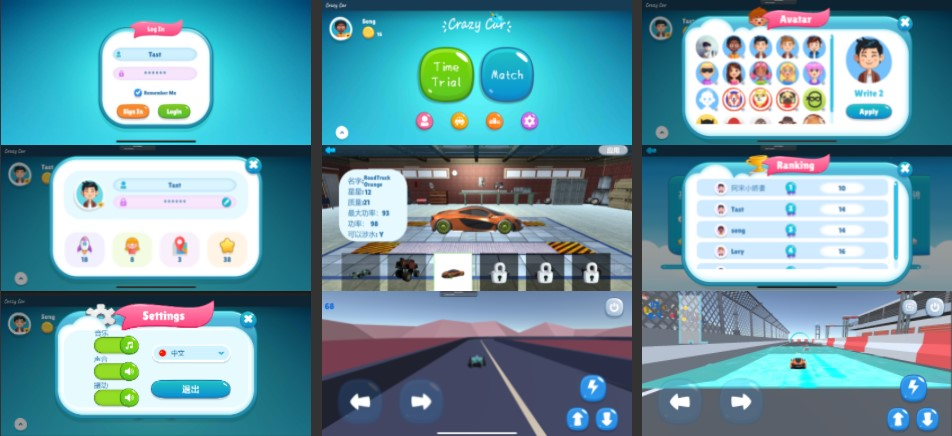
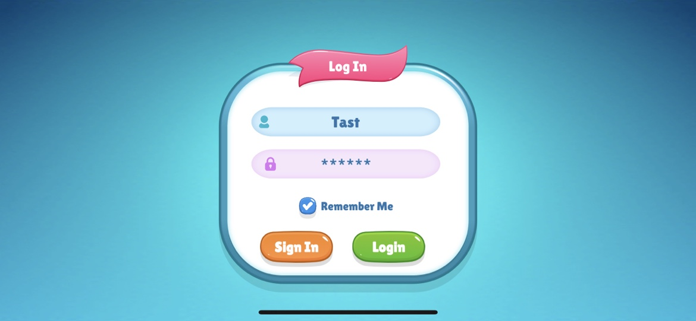
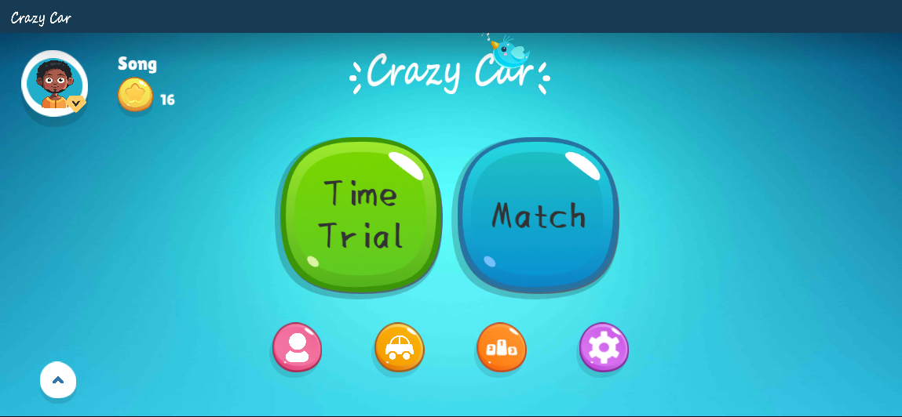
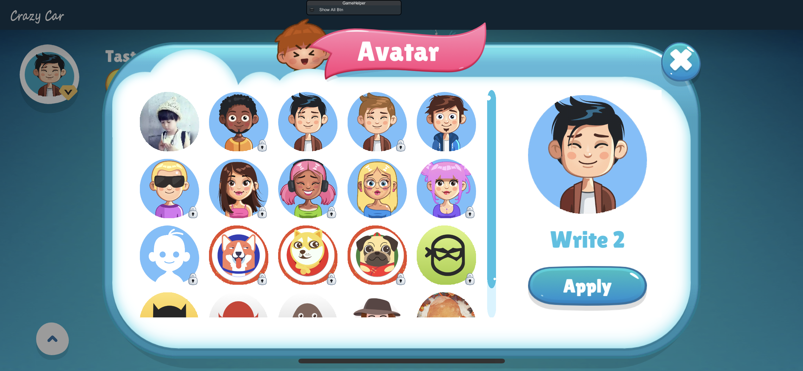
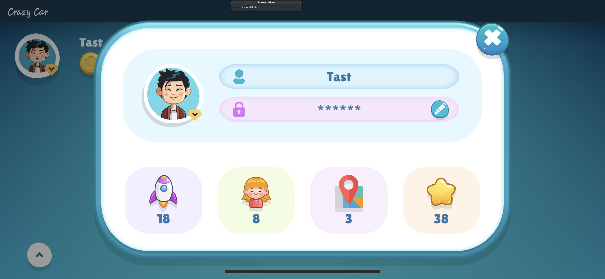
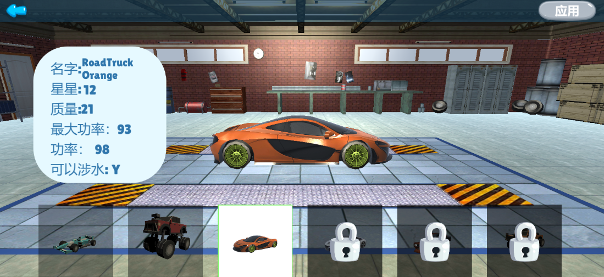
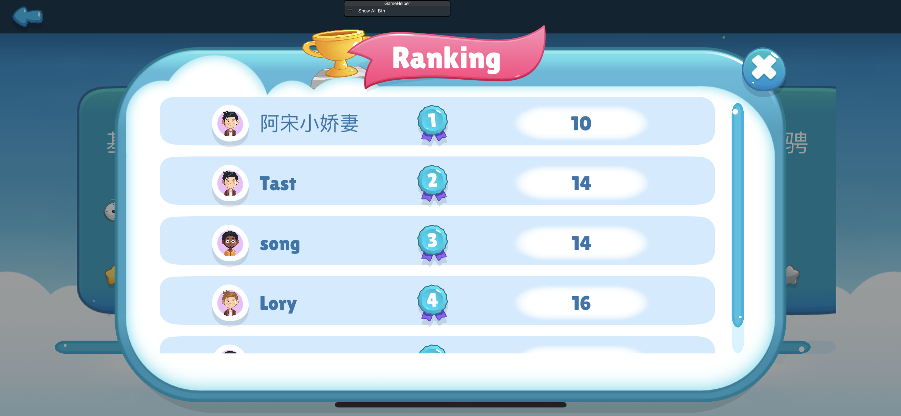
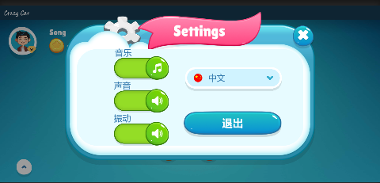
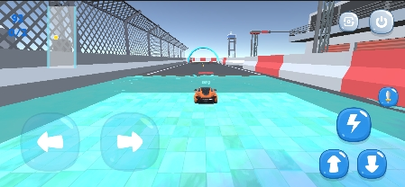
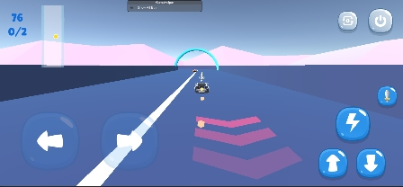

  <h2 href="https://github.com/TastSong/CrazyCar">
    
  </h2>
  <h2 align="center">
    Crazy Car
  </h1>
  <h3 align="center">
    Online racing game
  </h3>
    <a href = "https://github.com/TastSong/CrazyCar/releases">Download</a> | <a href = "https://github.com/TastSong/CrazyCar/releases">Homepage</a>  

 
 
 

  
  

 

[Quick Start](./README_QuickStart.md)&nbsp;  | &nbsp;[Technical Documentation](./README_Dev.md)&nbsp;| &nbsp;[Update Log](https://github.com/TastSong/CrazyCar/releases)&nbsp; | &nbsp;[中文](./README.md)

:clap:  Welcome **Crazy Car** ！ 

:sparkles: **Crazy Car** An online racing game, using Unity game engine development, using Java background and MySQL database 

:loudspeaker: **Crazy Car ** during the development phase, the online database is reset irregularly

## Features :point_down:
:pushpin:Mandatory version update is supported

:telephone:Supports switching between KCP and WebSocket  

:hammer:The game uses QFramework, easy to expand

:sunrise: Support avatar and equipment resource hot update

:rocket:  On the login page, you can switch the single-machine mode with one click

:car:  You can buy and wear avatars and racing cars

:computer: You can use this client on **Windows**、 **Android** and** IOS** devices

:earth_asia:  Support for multiple languag,Multiple languages can be created in one click with **translateeditor. cs**

:page_facing_up:  Personal information page, record personal achievements

:video_game:  Time trial and multiplayer competition two modes

:seedling: Of course **Crazy Car** is still young and has many shortcomings, but please believe that it will keep moving forward   :running:

:kissing_heart: Enjoy~

## Connection
:email: ： TastSong@163.com

## Sample screenshots

  
    
    
    
    
    
    
    
    
    

 

## contribution
You can submit questions in the  [pull requests](https://github.com/TastSong/CrazyCar/pulls) or [issues](https://github.com/TastSong/CrazyCar/issues) format.

## Reference

1. [UnityWebSocket: The Best Unity WebSocket Plugin for All Platforms. ](https://github.com/psygames/UnityWebSocket)
2. [QFramework: Unity3D System Design Architecture ](https://github.com/liangxiegame/QFramework)
3. [java-Kcp: 基于java的netty实现的可靠udp网络库(kcp算法)，包含fec实现，可用于游戏，视频，加速等业务 ](https://github.com/l42111996/java-Kcp)
4. [kcp4sharp: kcp for c#. ](https://github.com/beykery/kcp4sharp)
5. [DOTween (HOTween v2) Unity Asset Store](https://assetstore.unity.com/packages/tools/animation/dotween-hotween-v2-27676)
6. [Unity实现简化版卡丁车漂移](

## License
[MIT](https://github.com/TastSong/CrazyCar/blob/master/LICENSE)

